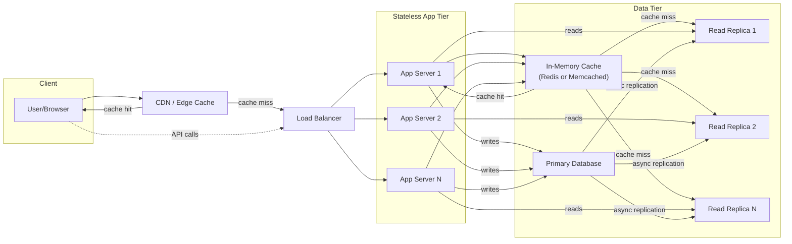
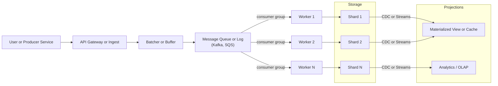

# ⚖️ Read vs Write Heavy Systems

Understanding whether your system is **read-heavy** or **write-heavy** helps determine how to optimize scalability, latency, and throughput.

---

## 📘 Read-Heavy Systems

### Common Techniques
- **Caching**
- **Read Replicas**
- **CDN**
- **Load Balancing**
- **Data Partitioning**
- **Indexing**

### 🔧 Optimization Strategies
**Caching:**  
Store frequently accessed data in memory (Redis, Memcached) to skip hitting the main DB every time. It’s a must for low latency.

**Read Replicas:**  
Use database replicas to spread out read load, keeping your primary DB free for writes — great for scaling.

**CDNs:**  
For static or semi-static content, CDNs bring data closer to the user — reducing latency and server load.

**Indexing:**  
Add indexes on frequently queried fields to speed up lookups (but don’t overdo it; too many indexes can slow down writes).

**Load Balancers:**  
Evenly distribute read traffic across multiple replicas or app servers for better throughput and fault tolerance.

### 🗺️ Mermaid — Read-Heavy Reference Architecture

---

## 🧾 Write-Heavy Systems

### Common Techniques
- **Database Optimization**
- **Asynchronous Processing**
- **Write Batching & Buffering**
- **Data Partitioning**
- **CQRS**
- **Event Sourcing**

### 🔧 Optimization Strategies
**Write-Friendly Databases:**  
Use NoSQL systems like Cassandra or DynamoDB that handle high write throughput.

**Batching:**  
Group writes together (logs, events, etc.) to reduce overhead and improve throughput.

**Asynchronous Writes:**  
Queue up writes and process them in the background so users don’t have to wait.

**Sharding:**  
Split your data across multiple database nodes to scale horizontally.

**Event-Driven Design:**  
Use logs or message queues (Kafka) to decouple producers from consumers and smooth out write bursts.

### 🗺️ Mermaid — Write-Heavy Reference Architecture

---

## 🧩 Summary

Both **read-heavy** and **write-heavy** systems can scale to millions of users — they just take different paths.

- **Read-heavy systems** rely on caching and replication to deliver snappy reads with low latency.  
- **Write-heavy systems** depend on robust pipelines, scaling-out, and data modeling to absorb torrents of writes.

> 💡 **Always ask yourself:** Is this design optimized for the predominant actions — reads or writes?
