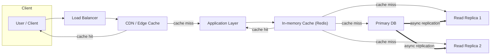

# 🧭 Scaling Reads

> **Goal:** Handle high read volumes efficiently as your system grows.

Many production systems handle 10× to 100× more **reads** than **writes**.  
The *Scaling Reads* pattern focuses on how to maintain low-latency reads and high throughput when your database or backend becomes a bottleneck.

---

## 📚 Concept Summary

| Layer | Technique | Purpose |
|-------|------------|----------|
| **Database** | Indexing, query optimization, denormalization | Optimize performance before adding infrastructure complexity |
| **Horizontal Scaling** | Read replicas, sharding | Spread reads across multiple nodes to offload the primary DB |
| **Caching Layers** | In-memory cache, CDN, edge cache | Serve hot data faster and reduce load on origin systems |

---

## ⚙️ 1. Optimize the Database First

Before scaling horizontally, squeeze as much efficiency as possible from a single instance.

**Techniques**
- Create **indexes** for frequent read paths.
- **Denormalize** to avoid excessive joins.
- Tune queries, use covering indexes, or simplify ORM calls.
- Upgrade CPU, RAM, or storage (vertical scaling).

> 🧠 Optimization before distribution: complexity scales faster than performance.

---

## 🧩 2. Horizontal Read Scaling

When one server isn’t enough, distribute the load.

**Options**
- **Read Replicas:**  
  - Primary handles writes, replicas handle reads.  
  - Improves read throughput and reduces latency.  
  - Watch for replication lag and eventual consistency.

- **Sharding:**  
  - Split data by key (e.g., user_id) across servers.  
  - Scales horizontally and isolates heavy users or hot data.

> ⚖️ Trade-off: replicas improve throughput but risk stale reads; sharding improves scalability but increases query routing complexity.

---

## 🧊 3. Caching Layers

**In-memory cache (Redis, Memcached):**
- Stores frequently accessed objects or query results.  
- Fast, but can become stale if invalidation is mishandled.

**CDN / Edge Cache:**
- For static or semi-static data (e.g., profiles, media).  
- Delivers data closer to users globally.  
- Offloads infrastructure and reduces latency.

### 🧠 Caching Strategies
| Type | Description | Use Case |
|------|--------------|----------|
| **Cache-Aside** | Application loads data into cache on demand | Most common, easy to reason about |
| **Write-Through** | Writes update cache and DB simultaneously | Ensures cache consistency |
| **Write-Back** | Writes update cache first, sync to DB later | High write throughput, eventual consistency |

---

## 🧱 4. Common Issues & Mitigations

| Challenge | Solution |
|------------|-----------|
| **Cache Stampede** | Use request coalescing (“single-flight”), add random TTL jitter |
| **Stale Data** | Invalidate cache on writes, use version keys |
| **Replica Lag** | Tune replication interval, read from primary for critical paths |
| **Hot Keys** | Add sharding or consistent hashing on cache layer |

---

## 🧠 Interview-Ready Takeaways

- Reads dominate most real-world systems; scaling them is essential for perceived performance.  
- Apply improvements in **layers**: DB → Replicas → Cache → CDN.  
- Always mention **consistency trade-offs** when describing read replicas or caching.  
- Cache invalidation is one of the hardest problems — mention mitigation techniques confidently.

---

## 🗺️ Mermaid — Read Scaling Reference Flow

---

💡 Key Reflection

Scaling reads is about removing repeated work.
Cache what’s hot, replicate what’s stable, and tune what’s heavy — in that order.
