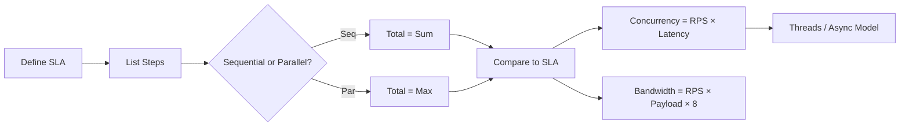

# 📐 System Design Estimation Sheet (Back-of-the-Envelope)

> Use this README to estimate **latency, throughput, concurrency, threads, and bandwidth** — quickly, clearly, and ADHD-friendly.

---

## 🧭 Core Mental Models

- **Little’s Law:**  
  `Concurrency ≈ Throughput × Latency`  
  (aka **R = λ × W** → Requests in flight = RPS × avg response time)

- **Critical Path Latency:**  
  `Sequential total = A + B + C` ; `Parallel total = max(A,B,C)`

- **SLA Budgeting:**  
  Give each stage a time budget that sums to your SLA (e.g., 300 ms).

---

## ⏱️ Latency Budget Template

Break your API into **Ping → Think → Fetch → Return** and fill in blanks:

| Stage | Budget (ms) | Notes |
|---|---:|---|
| Client ↔ Server (network) | ____ | DNS/TCP/TLS + RTT |
| App logic (CPU) | ____ | Auth, routing, business logic |
| Cache / DB | ____ | Cache hit (1–5 ms), DB (20–100+ ms) |
| Downstream calls | ____ | Count hops; parallelize where possible |
| Serialization + return | ____ | JSON/proto, compression |
| **Total** | **≤ SLA** | Aim ≤ 300 ms for interactive |

> 💡 **Tip:** Keep a 10–20% buffer for jitter.

---

## 🚦 Throughput, Latency, Concurrency

- **Given RPS and latency, estimate concurrency:**
  ```
  Concurrency (in-flight) = RPS × Latency_seconds
  ```
  Example: 600 RPS × 0.25 s = **150 concurrent requests**

- **Given max concurrency and latency, max safe RPS:**
  ```
  RPS_max ≈ Concurrency / Latency_seconds
  ```
  Example: 200 threads / 0.25 s ≈ **800 RPS**

- **Translate concurrency to threads (blocking model):**
  ```
  Threads_needed ≈ Concurrency × overhead_factor
  ```
  Example: 150 concurrent → ~180 threads (1.2× overhead)

> ⚠️ **Watch out:** If I/O‑bound, prefer async/reactive instead of many threads.

---

## 🔢 QPS ↔ CPU / Instance Count

Assume each instance can handle **X RPS** at target P95 (e.g., 120 RPS @ ≤ 250 ms):
```
Instances_needed ≈ ceil( Total_RPS / RPS_per_instance × headroom )
```
Example: 2400 RPS ÷ 120 × 1.25 = **25 instances**

> 💡 **Headroom:** 1.2–1.5 for traffic bursts.

---

## 🌐 Bandwidth & Payload Math

- **Request transfer time:**
  ```
  Transfer_ms ≈ (Payload_bytes × 8 / Link_bps) × 1000
  ```
  Example: 512 KB @ 100 Mbps → **42 ms** (minimum)

- **Link saturation:**
  ```
  Bandwidth_bps ≈ RPS × Payload_bytes × 8
  ```
  Example: 1000 RPS × 50 KB × 8 = **400 Mbps**

> 💡 Keep NIC < 70% utilization; compress > 10 KB payloads.

---

## 🧰 DB Capacity & Tail Latency

- **Max QPS:**
  ```
  QPS_max ≈ Concurrency_limit / Latency_seconds
  ```
  Example: 50 active / 0.02 = 2500 QPS

> ⚠️ **Rule of thumb:** P99 ≈ 3–5× avg latency.

---

## 📦 Cache ROI (Miss Rate)

- **Backend load:**
  ```
  Backend_QPS = Incoming_QPS × Miss_rate
  ```
- **Average latency:**
  ```
  L_avg = Hit_rate × L_hit + Miss_rate × L_miss
  ```
  Example: 90% hits (3 ms) + 10% misses (80 ms) = **10.7 ms** average.

---

## 🔁 Retries & Timeouts

- **Retry multiplier:** `Effective_RPS = Incoming_RPS × (1 + retry_rate)`  
  → 2% retries = 1.02× load

- **Timeout budgeting:** Split SLA among attempts (e.g., 300 ms → 140 ms × 2 + buffer)

> 🔄 Add **jitter** to backoff to avoid thundering herd.

---

## 🪵 Fan-Out / Fan-In Latency

| Pattern | Formula | Example |
|---|---|---|
| Sequential | Σ steps | 80 + 120 + 60 = 260 ms |
| Parallel | max(steps) + overhead | max(80, 120, 60) + 5 = **125 ms** |

---

## 🧪 Worked Example (E2E)

**Target SLA:** 300 ms  
**Flow:** REST API → Cache → DB + External API (Parallel)

| Step | Time (ms) |
|---|---:|
| Network RTT | 120 |
| App Logic | 30 |
| Cache / DB | 60 |
| External API (Parallel) | 80 |
| Serialization + Return | 30 |
| **Total** | ≈ **260 ms** ✅ |

**Throughput:** 1800 RPS × 0.26 s = 468 in‑flight → ~6 instances (120 per instance × 1.5 headroom)

---

## 🧩 Quick Reference Tables

### Latency Magnitudes
| Operation | Ballpark |
|---|---|
| In‑memory (Redis/Memcached) | 1–5 ms |
| Local DB (SSD) | 5–20 ms |
| Remote DB / Cross‑AZ | 50–100+ ms |
| Microservice hop | 10–50 ms |
| User↔DC RTT | 100–150 ms |
| Feels “instant” | < 300 ms E2E |

### Kafka‑Style Producer/Consumer Tuning
| Goal | Knob | Direction |
|---|---|---|
| Lower p99 | `linger.ms`, `batch.size` | ↑ for batching |
| Reduce payload | `compression.type` | gzip / zstd |
| Avoid dupes | Idempotence / Txn | Enable |
| Faster reads | Cache hit rate | ↑ |

---

## 🧠 Checklist

- [ ] Identify **critical path**  
- [ ] Mark **sequential vs parallel**  
- [ ] Assign **numbers**  
- [ ] Compute **Σ or max** vs SLA  
- [ ] Apply **Little’s Law**  
- [ ] Check **bandwidth + payload**  
- [ ] Add **timeouts, retries, buffers**  
- [ ] Validate **P95/P99**

---

## 🔍 Mermaid One‑Pager



---

✅ Paste this into any **system‑design or performance** repo to model latency, throughput, and scaling in seconds.

