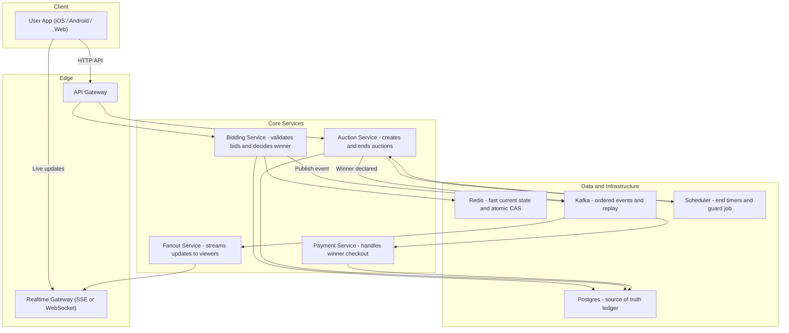
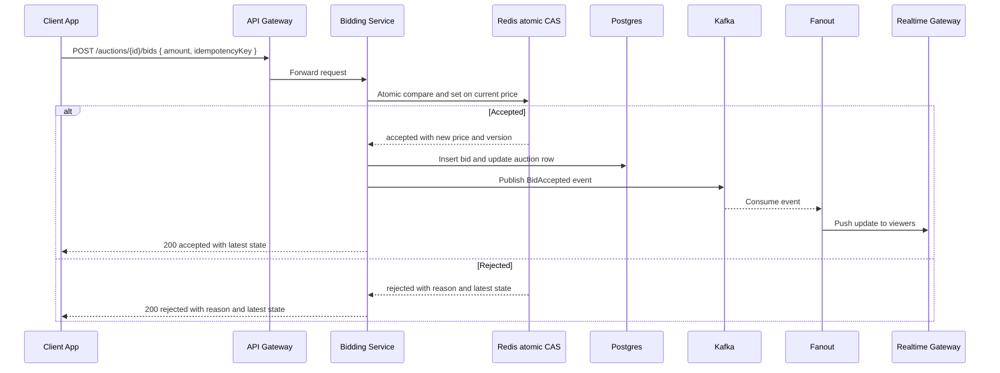
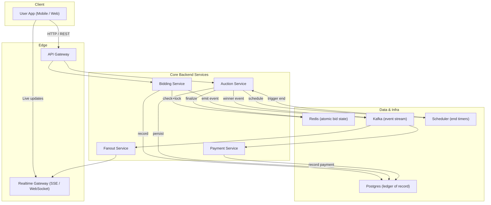

# Instagram Auctions — Beginner Friendly System Design

> Learn how an online auction feature (like Instagram Auctions) works from end-to-end — designed for clarity, fairness, and real-time updates.

---

## 📚 Table of Contents
- [🎯 Problem Statement](#-problem-statement)
- [🏗️ Architecture Overview](#️-architecture-overview)
- [⚙️ Place Bid Sequence](#️-place-bid-sequence)
- [⏲️ End Auction Sequence](#️-end-auction-sequence)
- [🧩 Bid Validation Flow](#-bid-validation-flow)
- [💾 Data Model Overview](#-data-model-overview)
- [🌐 API Surface](#-api-surface)
- [🧠 Beginner Takeaways](#-beginner-takeaways)

---

## 🎯 Problem Statement
Enable creators to run **time-boxed auctions on posts** where: <br>
- Only **one valid highest bid** is accepted at any moment.
- Viewers see **instant updates** as bids come in.
- The auction **always closes correctly** even under high traffic.
- **Fairness, scalability, and durability** are guaranteed.

---

## 🏗️ Architecture Overview

<details>
<summary>Beginner System Overview</summary>


</details>

How to read it: <br>
> •	The App talks to the API Gateway for requests and connects to Realtime Gateway for live data. <br>
•	Bidding Service is the only entry point for bids; it checks Redis for atomic fairness and logs to Postgres. <br>
•	Kafka streams all accepted bids for replay and fan-out to viewers. <br>
•	Auction Service schedules and seals auctions using a Scheduler so nothing is missed. <br>

---


⚙️ Place Bid Sequence
<details> <summary>Place Bid Sequence</summary>
  

</details>

Takeaway: <br>
> •	Redis ensures only one winner per moment (atomic compare-and-set). <br>
•	Postgres records the durable truth. <br>
•	Kafka → Fanout → Realtime sends instant updates to watchers. <br>

---

⏲️ End Auction Sequence
<details> <summary>End Auction Sequence</summary>
  
  ```mermaid
sequenceDiagram
  participant SCH as Scheduler
  participant A as Auction Service
  participant R as Redis
  participant DB as Postgres
  participant K as Kafka
  participant F as Fanout
  participant RT as Realtime GW

  SCH->>A: Trigger end-auction(auctionId)
  A->>R: Seal auction (stop further bids)
  A->>DB: Update status=ended and store final winner
  A->>K: Publish winner_declared event
  K-->>F: Consume event
  F->>RT: Push ended update to clients
```
</details>

Takeaway: <br>
A dual-path timer (delay queue + DB guard) ensures the auction ends on time even if one path fails.

---

🧩 Bid Validation Flow
<details> <summary>Bid Validation Flow</summary>

  ```mermaid
flowchart TD
  START([Receive bid]) --> TIME{Now < endAt?}
  TIME -- No --> LATE[Reject: late] --> END([Done])
  TIME -- Yes --> AMT{Amount >= current + increment?}
  AMT -- No --> LOW[Reject: too low] --> END
  AMT -- Yes --> CAS[Redis atomic compare and set]
  CAS -- Lost race --> RACE[Reject: another bid won] --> END
  CAS -- Won race --> OK[Accept and persist] --> END
```
</details>

Takeaway:
All checks are instant:
> Too late → rejected
Too low → rejected
Lost race → rejected
Only one “won CAS” bid is accepted

💾 Data Model Overview
<details> <summary>Data Model Overview</summary>
  
  ```mermaid
erDiagram
  AUCTION ||--o{ BID : has
  AUCTION {
    bigint id PK
    bigint post_id
    bigint seller_id
    timestamptz start_at
    timestamptz end_at
    numeric start_price
    numeric min_increment
    text status
    numeric current_price
    bigint current_winner_id
    bigint version
  }
  BID {
    bigint id PK
    bigint auction_id FK
    bigint bidder_id
    numeric amount
    timestamptz created_at
    text status
    text reason
    bigint version
    text idempotency_key
  }
```
</details>

Takeaway:
>Auction holds the latest status and winner.
Bid keeps every attempt for audit and fairness.
Version makes state comparisons deterministic.


---

🌐 API Surface
<details> <summary>Minimal API Surface</summary>
  
POST /auctions
Body: { postId, startAt, endAt, startPrice, minIncrement }
Resp: { auctionId }

GET /auctions/{id}
Resp: { id, status, currentPrice, currentWinnerId, startAt, endAt, version }

POST /auctions/{id}/bids
Headers: { Idempotency-Key: uuid }
Body: { amount, idempotencyKey? }
Resp:
  { status: "accepted", currentPrice, currentWinnerId, version }
  or
  { status: "rejected", reason, currentPrice, currentWinnerId, version }

GET /auctions/{id}/stream  ; Server-Sent Events
data: { type: "bid"|"tick"|"ended", auctionId, currentPrice, winnerId, version, remainingSeconds? }

</details>

---


🧠 Beginner Takeaways
> Redis = the fast auctioneer ensuring only one winner at a time.
Postgres = the official ledger keeping every record.
Kafka = the loudspeaker broadcasting new bids.
Scheduler = the timekeeper closing the auction.
Fanout & Realtime = the crowd announcers updating everyone instantly.

---

📈 Scaling Hot Auctions

When a celebrity runs an auction:

> Fanout shards handle thousands of concurrent viewers per auction.
Kafka partitions by auction_id, keeping bid ordering consistent but allowing parallel auctions.
Redis keys (auction:{id}) colocated per shard to prevent cross-node locks.
Rate limits and backpressure applied at Realtime Gateway to keep P99 latency below 500 ms.

---

🔒 Reliability & Failures

>If Redis restarts → rebuild from Postgres + Kafka tail.
If a delay queue fails → DB guard picks up missed end times.
All APIs use idempotency keys to make retries safe.
Exactly-once effect via versioning, not heavyweight transactions.

---


📊 Observability & Metrics
| Metric                      | Target   | Why                               |
| --------------------------- | -------- | --------------------------------- |
| **Bid Ack Latency (P99)**   | < 500 ms | Keeps UX snappy                   |
| **Redis CAS Conflict Rate** | < 5%     | Detects race spikes               |
| **Kafka Lag**               | < 5 s    | Ensures near-realtime fanout      |
| **End-Event SLA**           | 99.99%   | Guarantees closure                |
| **Fanout Drop Rate**        | < 1%     | Ensures consistent viewer updates |


Instrumentation:
>Traces tagged by auction_id and version.
Dashboards per auction surface.
Alerts for missed end events or Redis rebuilds.

---

🏁 Summary

>Fairness: Redis CAS ensures single-winner bids.
Scalability: Kafka + Fanout allow millions of concurrent viewers.
Durability: Postgres + replayable events prevent data loss.
Reliability: dual-path schedulers and reconcilers guarantee closure.
Clarity: simple, readable architecture that teaches system design fundamentals.

🎓 Designed to teach system-design reasoning for a manager-level audience at Meta — clarity first, scalability second, durability always.

---

<details>
<summary>Clean System Design Diagram (Mermaid)</summary>



</details>

## 🔄 End-to-End System Flow (Short Version)
 <br>
1️⃣ API Gateway
> Receives all REST requests from the app.
Routes /auctions → Auction Service, /bids → Bidding Service.
Handles auth, rate limits, and idempotency keys.

2️⃣ Bidding Service
> Validates bid timing and amount.
Uses Redis for an atomic compare-and-set (CAS) to decide the single winning bid.
Persists the accepted bid to Postgres.
Publishes a BidAccepted event to Kafka for fan-out.

3️⃣ Auction Service
>Creates and tracks auction lifecycle.
On creation → schedules an end time in the Scheduler.
On trigger → seals auction in Redis, updates Postgres, emits WinnerDeclared to Kafka.

4️⃣ Scheduler
> Maintains delay queues for auction end times.
Fires end-auction calls to Auction Service at the exact moment.
Has a DB guard job to catch any missed ends.

5️⃣ Fanout Service
>Subscribes to Kafka topics (bids, auction-events).
Converts events into realtime updates.
Pushes compact deltas (price, winner, version) to Realtime Gateway.

6️⃣ Realtime Gateway
> Maintains persistent SSE / WebSocket channels.
Streams updates to all connected clients.
Drops stale frames, always sends the latest version.

7️⃣ Payment Service
> Listens for WinnerDeclared.
Handles winner checkout flow and updates Postgres.

8️⃣ Data Layer Summary
| Component     | Purpose                               |
| ------------- | ------------------------------------- |
| **Redis**     | Atomic bid lock + hot cache           |
| **Postgres**  | Durable truth of auctions & bids      |
| **Kafka**     | Ordered, replayable event log         |
| **Scheduler** | Reliable timers for auction end       |
| **Guard Job** | Repairs missed or inconsistent states |

---

🧠 TL;DR Path Example
> User → API Gateway → Bidding Service → Redis CAS → Postgres → Kafka → Fanout → Realtime Gateway → Viewers


