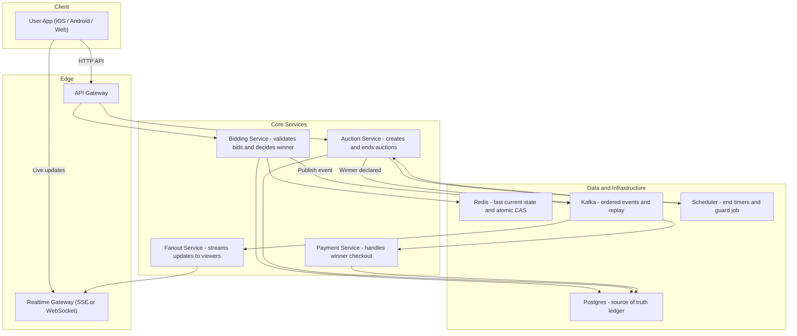
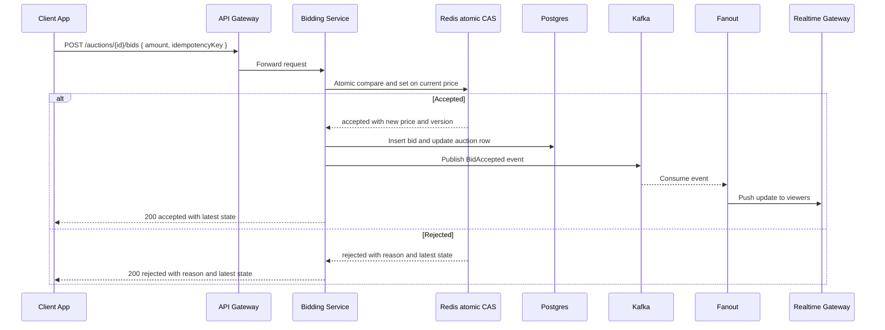

# Instagram Auctions — Beginner Friendly System Design

> Learn how an online auction feature (like Instagram Auctions) works from end-to-end — designed for clarity, fairness, and real-time updates.

---

## 📚 Table of Contents
- [🎯 Problem Statement](#-problem-statement)
- [🏗️ Architecture Overview](#️-architecture-overview)
- [⚙️ Place Bid Sequence](#️-place-bid-sequence)
- [⏲️ End Auction Sequence](#️-end-auction-sequence)
- [🧩 Bid Validation Flow](#-bid-validation-flow)
- [💾 Data Model Overview](#-data-model-overview)
- [🌐 API Surface](#-api-surface)
- [🧠 Beginner Takeaways](#-beginner-takeaways)

---

## 🎯 Problem Statement
Enable creators to run **time-boxed auctions on posts** where:
- Only **one valid highest bid** is accepted at any moment.
- Viewers see **instant updates** as bids come in.
- The auction **always closes correctly** even under high traffic.
- **Fairness, scalability, and durability** are guaranteed.

---

## 🏗️ Architecture Overview

Beginner System Overview

How to read it:
•	The App talks to the API Gateway for requests and connects to Realtime Gateway for live data.  
•	Bidding Service is the only entry point for bids; it checks Redis for atomic fairness and logs to Postgres.  
•	Kafka streams all accepted bids for replay and fan-out to viewers.  
•	Auction Service schedules and seals auctions using a Scheduler so nothing is missed.  

---

⚙️ Place Bid Sequence

 
Place Bid Sequence

  

Takeaway:
•	Redis ensures only one winner per moment (atomic compare-and-set).  
•	Postgres records the durable truth.  
•	Kafka → Fanout → Realtime sends instant updates to watchers.  
