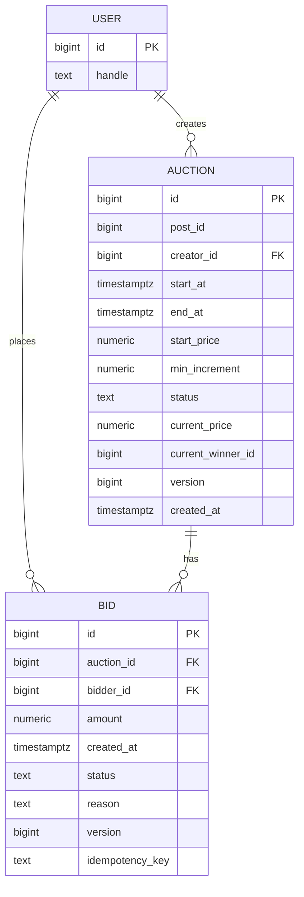
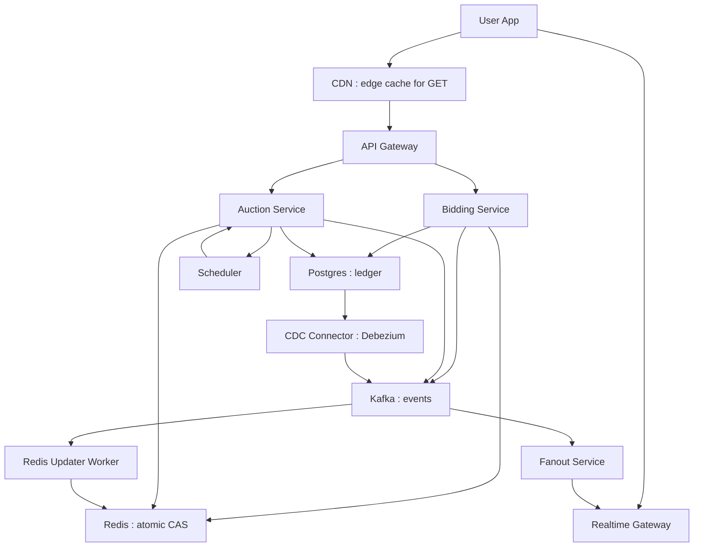
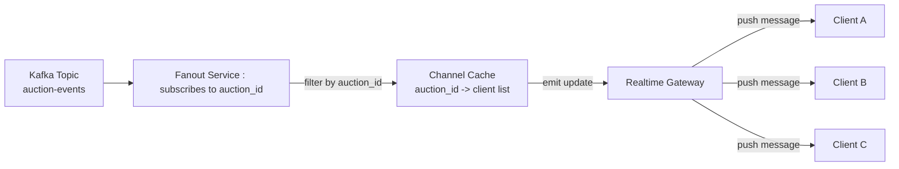
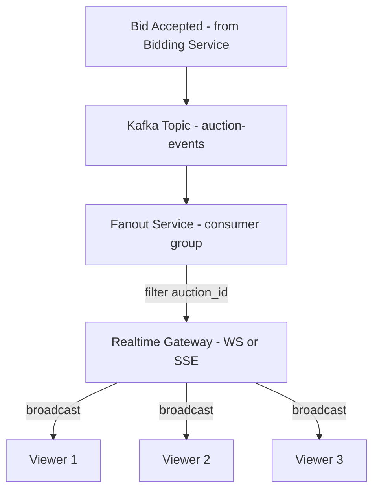

# 🧠 Instagram Auctions — Deep Dive System Design 

> Scope: **Auction feature only** — create auctions, place bids fairly, realtime updates, and reliable end-of-auction. (Payments and post-auction flows are out of scope.)

---

## 1️⃣ Functional Requirements

**Creator**
- Create a time-boxed auction on a post with: `startAt`, `endAt`, `startPrice`, `minIncrement`.
- Start, pause (optional v2), and end auctions; view current state and history.

**Bidder**
- Place a bid ≥ `currentPrice + minIncrement` while auction is active.
- Get immediate accept/reject with latest state; retries must be **idempotent**.

**Viewer**
- Subscribe to live updates (highest bid, winner, countdown).
- Read auction details and historical bids.

**System**
- Automatically end auctions at `endAt` and seal further bids.
- Expose APIs to fetch auction state and bid history.

---

## 2️⃣ Non-Functional Requirements

- **Fairness & Consistency:** Exactly one highest bid at any instant per auction (atomic decision).
- **Low Latency:** P50 < 150 ms, P99 < 500 ms for bid acknowledgement under spike.
- **Scalability:** Thousands of simultaneous auctions; hot auctions with 100k+ viewers.
- **Durability:** No loss of accepted bids; auditable history.
- **Reliability:** No missed end events (timer guarantees); safe retries (idempotency).
- **Observability:** Metrics for latency, CAS conflicts, Kafka lag, end-event SLA.
- **Security:** Authn at gateway, authz by role (creator, bidder, viewer).

---

## 3️⃣ Core Entities & Relationships



**Notes:**  
- `AUCTION.status`: {`scheduled`, `active`, `ended`}  
- `BID.status`: {`accepted`, `rejected`, `late`, `invalid`}  
- `version` increments on every accepted bid; clients apply **last-version-wins**.  
- `idempotency_key` dedupes client retries per `(auction_id, bidder_id)`.

---

## 4️⃣ API Design (Auction Feature Only)

### Create Auction
```
POST /auctions
Body: {
  postId: string,
  startAt: ISO8601,
  endAt: ISO8601,
  startPrice: number,
  minIncrement: number
}
Resp: { auctionId: string }
Owner: Auction Service
```

### Get Auction
```
GET /auctions/{id}
Resp: {
  id, postId, creatorId,
  status, startAt, endAt,
  currentPrice, currentWinnerId, minIncrement, version
}
Owner: Auction Service
Cache: CDN edge cache with short TTL and event-driven invalidation
```

### Place Bid (Idempotent)
```
POST /auctions/{id}/bids
Headers: { Idempotency-Key: uuid }
Body: { amount: number }
Resp (accepted): { status:"accepted", currentPrice, currentWinnerId, version }
Resp (rejected): { status:"rejected", reason, currentPrice, currentWinnerId, version }
Owner: Bidding Service
No cache (write path)
```

### Stream Updates (Realtime)
```
GET /auctions/{id}/stream     // Server-Sent Events or WebSocket
data: {
  type: "bid"|"tick"|"ended",
  auctionId, currentPrice, winnerId, version, remainingSeconds?
}
Owner: Realtime Gateway
Edge note: may traverse edge POPs; not cached
```

---

## 5️⃣ High-Level Design & Rationale



**Why these components?**
- **Redis (Lua CAS):** atomic winner decision under contention; sub-ms path.
- **Postgres:** authoritative ledger for auctions and bids (ACID, audit).
- **Kafka:** ordered, replayable events driving fanout and recovery.
- **Scheduler:** reliable end-of-auction triggers with a DB guard job.
- **CDN:** offloads read-heavy GETs; lowers tail latency globally.
- **CDC + Redis Updater:** keeps Redis **eventually consistent** with DB mutations.
- **Fanout + Realtime:** decouple compute from delivery; push deltas to clients.

---

## 6️⃣ End-to-End Flow (Bid & End)

**Bid Flow**
1) App → **API Gateway** → **Bidding Service** with `Idempotency-Key`.
2) **Bidding** reads hot state from **Redis**; validates time + amount.
3) **Lua CAS**: if `amount >= current + increment` → set new price & winner; bump `version`. Else reject with latest state.
4) If accepted: write **Bid** row and update **Auction** in **Postgres**; publish `BidAccepted` to **Kafka**.
5) **Fanout** consumes and pushes compact delta to **Realtime**; clients update by `version`.
6) **CDN invalidation:** a lightweight event hook triggers edge purge or soft-invalidate for `/auctions/{id}`.

**End Flow**
1) **Auction Service** schedules end on **Scheduler** at `endAt`.
2) Scheduler triggers `end-auction` → **Auction Service** seals **Redis** (no more CAS accepts).
3) Finalize in **Postgres** (`status=ended`, final `winner_id`, `current_price`); publish `WinnerDeclared`.
4) **Fanout** notifies clients (`type="ended"`); **CDN** invalidated for stale GETs.

---

## 7️⃣ Consistency, Idempotency, Ordering

- **Per-auction consistency:** Redis key `auction:{id}` is the single writer via CAS.
- **Idempotency:** `(auction_id, bidder_id, idempotency_key)` unique index returns the first result on retries.
- **Ordering:** Kafka **keyed by `auction_id`** preserves event order to Fanout and CDC consumers.
- **Client updates:** monotonic `version` → drop older frames, render latest only.

---

## 8️⃣ Scaling & Reliability (What interviewers probe)

**Scaling**
- Redis and Kafka **sharded by `auction_id`** to isolate hot auctions.
- Fanout workers scale per channel; Realtime coalesces updates to keep latency low.
- DB partitioning by time or creator to maintain write throughput.
- CDN edges absorb read spikes and keep origin traffic stable.

**Reliability**
- **Dual timers:** delay queue + DB guard prevent missed ends.
- **Reconciler:** repairs Postgres vs Redis drift using Kafka tail.
- **Redis rebuild:** if cache loss, reconstruct from Postgres + latest events.
- **At-least-once fanout:** safe via version monotonicity.
- **CDC pipeline:** ensures Redis is updated if DB is changed by any path.

---

## 🧩 Cache Miss Handling (Detailed)

When a cache miss occurs (e.g., Redis node restart, eviction, or cold auction read):

1️⃣ **Detect Miss:**  
   - The Bidding or Auction Service queries Redis for `auction:{id}`.  
   - If key is missing or stale (`nil`), the service **falls back to Postgres** (authoritative source).  

2️⃣ **Rehydrate from Database:**  
   - Read current `current_price`, `current_winner_id`, `end_at`, `min_increment`, and `version` from Postgres.  
   - Optionally fetch the latest accepted bid to confirm integrity.  

3️⃣ **Repopulate Redis:**  
   - Recreate the Redis key `auction:{id}` with the same structure (`current_price`, `current_winner_id`, `end_at`, `version`).  
   - Apply a short TTL (e.g., 5–10 minutes) or revalidate upon bid mutation.  

4️⃣ **Return to Caller:**  
   - Once repopulated, process the bid or read normally.  
   - If this happens during a write path (bid placement), the Redis CAS script runs **after** rehydration, ensuring atomic correctness.  

**Why this matters:**  
- Guarantees correctness without waiting for background rebuilds.  
- Keeps Redis purely as a *performance layer*, not a source of truth.  
- Enables horizontal elasticity (Redis shards can scale or restart safely).  

---

## 9️⃣ Key Trade-offs (Why this over alternatives)

| Area | Choice | Why | Trade-off |
|------|--------|-----|-----------|
| Bid coordination | Redis Lua CAS | Fast atomicity under spikes | Needs reconcilers for drift |
| Source of truth | Postgres | ACID, auditability, simple queries | Higher write latency than KV |
| Realtime transport | SSE (start), WS (hot rooms) | Simpler, CDN friendly; upgrade as needed | SSE is one-way |
| Fanout backbone | Kafka | Ordered, replayable, decouples compute | Operational overhead |
| Timer strategy | Scheduler + DB guard | Never miss end events | Extra moving parts |
| Edge strategy | CDN edge cache | Cut global read latency and origin load | Requires invalidation hooks |
| Data sync | CDC into Kafka | Keeps Redis in sync post-DB writes | Extra infra + schema discipline |

---

## 🔟 Interview TL;DR (30 seconds)

“**Bids** go Gateway → Bidding → **Redis CAS** (atomic winner) → Postgres → Kafka → Fanout → Realtime → clients.  
**Ends** are triggered by Scheduler; Auction Service seals Redis and finalizes DB.  
**CDN** accelerates reads; **CDC** keeps Redis aligned with DB;  
Redis = fairness & speed; Postgres = truth; Kafka = order & replay; Scheduler = reliability.”


---

# 🧩 Instagram Auctions — Deep Dives

## 1️⃣ Guaranteeing Fairness and Strong Consistency Under Contention

**Problem:**  
Multiple users may bid within the same millisecond on a hot auction (e.g., celebrity item).  

**Design:**
- Redis key `auction:{id}` acts as the *atomic state* — it stores `{price, winner, version}`.  
- All bids run through a **Lua CAS (Compare-and-Set)** script:  
  - If `bid.amount > current_price`, update atomically and increment `version`.  
  - If not, reject immediately.  
- Postgres persists each accepted bid and updates auction record.  
- **CDC (Debezium → Kafka → Redis Updater)** backfills Redis if the cache lags or misses an event.  
- **Idempotency key** guarantees retries are safe.  

**Why this works:**  
- Redis ensures single-winner atomicity.  
- Postgres + CDC guarantees eventual consistency and durability.  
- CDN ensures global fairness by reducing latency differences between regions.

---

## 2️⃣ Ending Auctions Reliably at Scale (Including Anti-Sniping / Soft-Close)

**Problem:**  
Timers can drift, nodes restart, or “sniping” (last-second bids) can disrupt fairness.  

**Design:**
- Two-layer timer:  
  1. **Scheduler Service** (delay queue) triggers end-auction jobs at `endAt`.  
  2. **DB Guard Job** polls for overdue auctions every minute.  
- “Soft-close” logic:  
  - If a bid arrives within N seconds of `endAt`, extend the auction by +N seconds (Postgres-driven).  
  - Redis key updated via CDC; Kafka event pushes new `endAt` to all subscribers.  
- **Idempotent end flow:**  
  - Auction sealed (`status=ended` in Redis + Postgres).  
  - Winner recorded, notifications broadcast.  

**Why this works:**  
- Dual-path timer prevents missed or double ends.  
- CDC ensures Redis reflects Postgres extensions.  
- CDN invalidation ensures users see the updated timer globally within seconds.

---

## 3️⃣ Broadcasting Real-Time Highest-Bid Updates at Scale

**Problem:**  
Millions of concurrent viewers need sub-second updates without crushing infra.  

**Design:**
- Kafka → Fanout → Realtime Gateway → Clients.  
- **Fanout** groups subscribers per auction ID.  
- **Realtime Gateway (SSE/WS)** coalesces updates and sends versioned deltas.  
- **CDN Edge POPs** cache lightweight `/auctions/{id}` GETs and **invalidate** on Kafka `BidAccepted` or `WinnerDeclared` events.  
- **CDC** ensures Redis and DB are in sync even if Realtime or Fanout delays occur.  

**Why this works:**  
- Only deltas are streamed; CDN offloads read pressure.  
- Global edge reduces tail latency; updates remain push-driven, not polled.  
- CDC prevents stale reads by keeping Redis aligned with Postgres.  

---

## 4️⃣ Handling Final-Minute Surges (Hot Auctions / Celebrity Items)

**Problem:**  
Massive last-minute traffic spikes can overwhelm Redis or drop bids.  

**Design:**
- Redis cluster sharded by `auction_id` — each hot auction isolated to its own node.  
- Backpressure protection: queue extra requests in in-memory FIFO (async retry).  
- **Fallback path:**  
  - On Redis saturation or timeout → route directly to Postgres write queue (slower but durable).  
  - **CDC** then rehydrates Redis asynchronously.  
- **CDN** continues serving stale reads with `stale-while-revalidate` headers to avoid client timeouts.  

**Why this works:**  
- Preserves fairness (no lost bids).  
- Keeps system alive under surge.  
- Balances durability (DB) vs latency (Redis).  
- CDC and CDN cooperate: CDC repairs Redis state; CDN shields clients from transient lag.

---


---

# 🛰️ Fanout Service Architecture

## 💡 Concept Overview
Fanout is the mechanism that transforms **a single event** (like a new bid) into **a broadcast to all interested clients** in real time.

Think of it as the auction “announcer.”  
When one bidder raises their paddle, **Fanout** shouts the new price to every viewer, instantly and fairly.

---

## ⚙️ Role in the System
When a bid is accepted:
1. The **Bidding Service** publishes `BidAccepted` to **Kafka**.
2. The **Fanout Service** consumes these events, filters by `auction_id`, and pushes updates to connected clients through the **Realtime Gateway**.
3. Each auction corresponds to a logical “channel” that subscribers join or leave dynamically.

---

## 📊 Fanout Data Flow Diagram



### Explanation:
- **Kafka → Fanout:** Fanout consumes messages per `auction_id` partition.
- **Channel Cache:** Keeps a live map of which clients are watching which auctions.
- **Realtime Gateway:** Handles the actual client socket connections and sends updates as compact JSON payloads.

---

## 🧩 Zoomed-In Architecture



**Notes:**
- The **Fanout Service** doesn’t store state permanently — it’s stateless and can scale horizontally.
- Each **Kafka partition** can handle one or more auctions; this keeps updates ordered and replayable.
- The **Realtime Gateway** is the only component aware of client sockets; Fanout only pushes messages upstream.

---

## ⚖️ Design Decisions

| Decision | Why | Trade-off |
|-----------|-----|------------|
| **Consume from Kafka** | Guarantees ordered, replayable updates per auction | Adds slight lag (~tens of ms) |
| **Per-auction channel cache** | Reduces noise; only relevant viewers get updates | Requires in-memory coordination |
| **Stateless fanout workers** | Horizontal scalability, easy fault recovery | Needs session sync (Redis or Consul) |
| **Batched broadcasts** | Reduces bandwidth and cost | Adds small (100–200 ms) delay |
| **Use of Realtime Gateway (SSE/WS)** | Offloads connection management from Fanout | Adds extra network hop |

---

## 🌍 Interaction with CDN and CDC

| Integration | Description | Why it Matters |
|--------------|--------------|----------------|
| **CDN Edge** | Caches non-live GETs (e.g., auction detail pages). Fanout invalidates CDN edges on updates. | Reduces global latency and keeps late joiners up to date. |
| **CDC Pipeline** | Streams DB → Kafka → Redis Updater → Fanout. Ensures state parity between DB and cache. | Prevents Redis from serving stale states and maintains consistency during rebalance. |

---

## 🧠 Summary (Verbal Form)
> “Fanout consumes ordered bid events from Kafka, filters them per auction, and pushes updates through Realtime Gateways to active viewers.  
> It scales horizontally, keeps connections lightweight, and uses CDN for passive viewers.  
> CDC ensures consistency, and Redis backs quick lookups, but Fanout itself is ephemeral — just a high-speed courier.”

---
