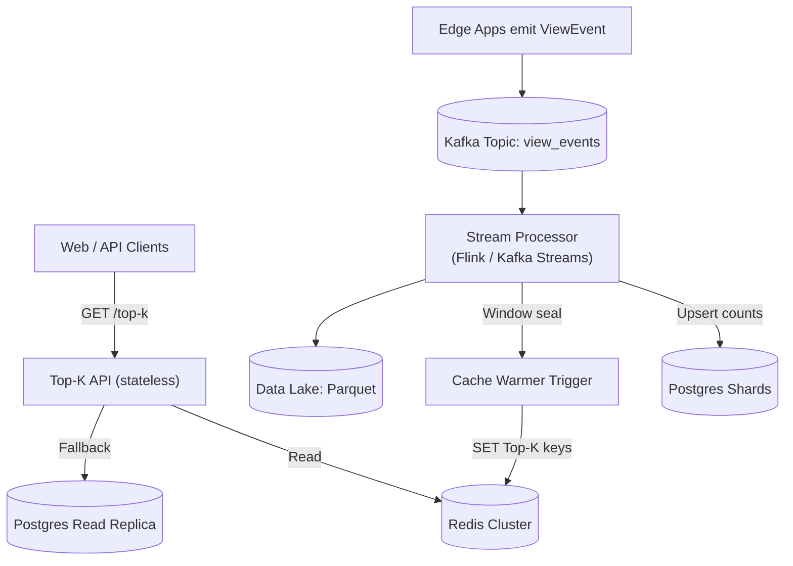

# Top-K Service (Hour/Day/Month/All-Time)

**Goal:** Return the **top-K most viewed items** for fixed windows (**hour, day, month**) plus **all-time** with **tens-of-ms** read latency and a simple, correct operational model.

## Table of Contents
- [Problem & Constraints](#problem--constraints)
- [API Contract](#api-contract)
- [Architecture](#architecture)
- [Data Model (Postgres)](#data-model-postgres)
- [Streaming & Windowing](#streaming--windowing)
- [Caching Strategy (Redis)](#caching-strategy-redis)
- [Scaling Plan](#scaling-plan)
- [Trade-offs](#trade-offs)
- [Failure Modes & Mitigations](#failure-modes--mitigations)
- [Runbook & SLOs](#runbook--slos)
- [Interview Talk-Track: Good → Great → Staff+](#interview-talk-track-good--great--staff)
- [Appendix: Alternatives & Notes](#appendix-alternatives--notes)

---

## Problem & Constraints

- Windows: **last hour**, **last day**, **last month**, **all-time**  
- Correctness: **exact counts** (with a small lateness buffer)  
- Freshness: window sealed at boundary + **lateness buffer** (e.g., 60s)  
- Read latency SLO: **p99 < 50 ms** (from cache)  
- Write volume: high, spiky; ingestion must be durable & scalable  
- Cardinality: very large `video_id`/`item_id` space; skewed popularity (Zipf)

---

## API Contract

```
GET /top-k?window={hour|day|month|all}&k={1..1000}
200 OK
{
  "window": "hour",
  "start": "2025-10-19T13:00:00Z",
  "end":   "2025-10-19T14:00:00Z",
  "as_of": "2025-10-19T14:01:00Z",
  "items": [
    {"id": "v_123", "count": 98123},
    {"id": "v_777", "count": 97210}
  ]
}
```

---

## Architecture

```mermaid
flowchart TD
  U[Clients (Web/API)] -->|GET /top-k| API[Top-K API (stateless)]
  API -->|GET| REDIS[(Redis Cluster)]
  API -->|fallback| REPL[(Postgres Read Replica)]
  EVT[Edge Apps emit ViewEvent] --> KAFKA[(Kafka Topic)]
  KAFKA --> SP[Stream Processor (Flink/Kafka Streams)]
  SP -->|upsert| PG[(Postgres Shards)]
  SP -->|window seal| WARM[Cache Warmer Trigger]
  WARM -->|SET Top-K keys| REDIS
  SP --> LAKE[(Data Lake: Parquet)]
```

---

## Data Model (Postgres)

```sql
CREATE TABLE all_time_views (
  item_id BIGINT PRIMARY KEY,
  views BIGINT NOT NULL DEFAULT 0,
  updated_at TIMESTAMPTZ NOT NULL DEFAULT now()
);

CREATE TABLE hour_views (
  window_start TIMESTAMPTZ NOT NULL,
  item_id BIGINT NOT NULL,
  views BIGINT NOT NULL DEFAULT 0,
  PRIMARY KEY (window_start, item_id)
);

CREATE INDEX hour_views_by_count_desc
  ON hour_views (window_start, views DESC);
```

---

## Streaming & Windowing

- **Windows:** tumbling (hour/day/month)
- **Lateness buffer:** e.g. 60s
- **At window seal:** finalize aggregates, compute Top-K, warm Redis

---

## Caching Strategy (Redis)

**Keys**
```
topk:hour:current -> 2025-10-19T14:00:00Z
topk:hour:2025-10-19T14:00:00Z
topk:day:current
topk:all
```

**Payload**
```json
{
  "as_of": "2025-10-19T14:01:00Z",
  "items": [["v_123",98123],["v_777",97210]]
}
```

---

## Scaling Plan

1. Single Postgres + Redis cache
2. Kafka + Flink for windows
3. Shard Postgres + Redis cluster
4. Approx heavy-hitters if extreme scale

---

## Trade-offs

| Decision | Pros | Cons | Why |
|-----------|------|------|-----|
| Tumbling windows | Simple | Slight delay | Predictable |
| Precompute Top-K | Fast reads | Warmer complexity | Stable latency |
| Redis cache | Sub-ms | Coherency | Separation |
| Postgres SoT | Exact | Sharding later | Simplicity |

---

## Failure Modes & Mitigations

- Late events → late bin + correction job  
- Cache loss → rebuild from Postgres  
- Stream downtime → Kafka replay

---

## Runbook & SLOs

- p99 < 50ms (cache), <300ms (fallback)
- Seal +60s lateness
- Cache hit rate > 98%
- Stream watermark delay alert

---

## Interview Talk-Track

**GOOD:** Precompute Top-K → Redis cache → fallback Postgres.  
**GREAT:** Kafka + Flink → tumbling + lateness → atomic cache warm.  
**STAFF+:** Align partitions = shards; mitigate hot keys; add approximations.

---

## Appendix

- Redis Sorted Sets for small data
- MV fallback in Postgres
- TTLs: sealed windows persist; all-time refreshed
