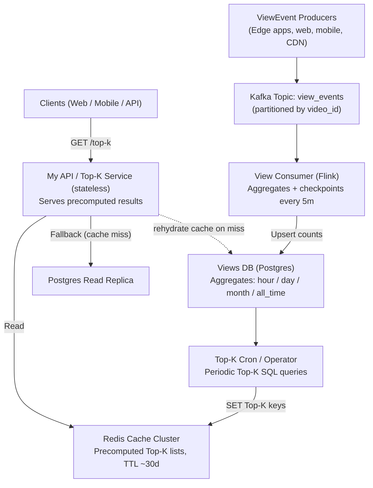

# 🧠 Deep-Dive — Top-K Views Architecture (Kafka · Flink · Postgres · Redis)

> **Goal:** Find the most-viewed videos quickly (Top-K) with accurate counts, even when millions of people are watching at once.

----
 > **Func Req's:*** <br>
>  All-Time top-k videos (max 1000) <br>
> Tumbling 1 hour, 1 day, 1 month, all-time <br>

> **Non-Func Req's:** <br>
> 1s delay to writes <br>
> No approximations <br>
> Massive # of views (TBD) <br>
> Massive # of videos (TBD) <br>
> Results in 10-100ms <br>


----
> **Core Entities:** <br>
> Video <br>
> View <br>
> Time Window <br>

---

>
> **API Interface:** GET /views/top-k?window={WINDOW}&k={K} -> { videoId: string, views: number }[]
>
 ---

> **Solution:** We partition Kafka by videoId and key Flink by videoId, so each video’s stream is ordered and processed by a single parallel task.
> Flink aggregates by fixed windows and writes idempotent updates into Postgres. We index each window table on (window_start, views DESC) so Top-K is index-friendly. A small job precomputes Top-K lists into Redis; the API reads from cache for constant-time latency. If load rises, we add Kafka partitions, bump Flink parallelism, and shard Postgres by videoId, keeping the same key across the stack for simple, linearly scalable operations.”
>
---


## 🧩 System Diagram


---

## 1️⃣ **ViewEvent Producers → Kafka**  
**Think of Kafka as a postal sorting center.**  
- Every time someone watches a video, a `ViewEvent` is created.  
- Instead of writing straight to the database (which would melt under millions of requests), each event is **sent to Kafka**, which queues and organizes them.  
- Kafka breaks these into **partitions** (like conveyor belts). Each belt only handles one subset of videos — maybe videos whose IDs end in certain numbers.  

📦 **Why this matters:**  
- If one video goes viral, only its partition gets busy — others stay smooth.  
- Kafka guarantees **ordering within each partition**, so event order stays consistent for that video.  
- Nothing is lost; Kafka stores data durably on disk until it’s processed.

🧩 **Beginner takeaway:**  
Kafka doesn’t change your data — it’s the “inbox” that absorbs unpredictable spikes so nothing breaks.

---

## 2️⃣ **Kafka → Flink (View Consumer)**  
**Flink is your “real-time accountant.”**  
- It reads events from Kafka and counts them up in near-real-time.  
- But instead of counting forever, it groups data into **time windows** — for example: “all views between 9:00 and 10:00.”  

🕒 **Windows**  
- **Tumbling windows:** fixed, non-overlapping blocks of time (like boxes on a timeline).  
- **Sliding windows:** overlapping windows (more detailed but more costly).  
You’re using tumbling windows — simple and scalable.  

🚰 **Watermarks & lateness:**  
- Watermarks tell Flink, “we’ve probably received everything up to time T.”  
- But if a view arrives late (say a mobile client was offline), Flink can still count it as long as it’s within the **lateness buffer** (e.g., 60 seconds).  
- Once the lateness window closes, the count is final and Flink “seals” the window.

🧩 **Beginner takeaway:**  
Flink constantly listens to Kafka, grouping views by video and time.  
It ensures no double counting and tolerates late events gracefully.

---

## 3️⃣ **Flink → Postgres (Views DB)**  
Once Flink finishes counting a window, it writes the totals to Postgres — your **source of truth.**

🧮 **Example:**  
| window_start | video_id | views |
|---------------|-----------|-------|
| 2025-10-19T14:00 | vid_777 | 97,210 |

⚙️ **The insert logic uses “upsert”:**  
```sql
INSERT INTO video_views_hour(window_start, video_id, views)
VALUES ($1,$2,$3)
ON CONFLICT (window_start, video_id)
DO UPDATE SET views = video_views_hour.views + EXCLUDED.views;
```
That means if the row already exists, it just increases the count — no duplicates.  
If Flink retries after a crash, no double counting happens.

💾 **Database structure:**  
- `video_views_hour` — rolling hourly stats.  
- `video_views_day` — daily aggregates.  
- `video_views_month` — monthly aggregates.  
- `video_views_all_time` — cumulative total.  

🧩 **Beginner takeaway:**  
Postgres is where you store the **exact** results.  
Flink just streams data in; Postgres keeps it correct and durable.

---

## 4️⃣ **Top-K Cron / Operator → Redis**  
Now we want to make “Top 100 videos this hour” queries fast.  
You **don’t** want to run a `SELECT … ORDER BY … LIMIT 100` every time — it’s slow and expensive.  

That’s why we precompute.  
A small **cron job** (or a background process) runs every few minutes:
```sql
SELECT video_id, views
FROM video_views_hour
WHERE window_start = $1
ORDER BY views DESC
LIMIT 100;
```

It stores the result in **Redis** as a ready-to-serve JSON blob:  
```
topk:hour:2025-10-19T14:00 → { items: [["v1",98123],["v7",97210], ...] }
topk:hour:current → "2025-10-19T14:00"
```

🧠 **Redis = memory cache**  
- Data is stored in RAM for ultra-fast reads.  
- You can set a **TTL** (time-to-live) like 30 days so old data expires.  
- Because Redis is so fast, it handles thousands of API requests per second.

🧩 **Beginner takeaway:**  
The cron is a **pre-builder** — it prepares answers before users even ask.  
Redis is the **vending machine** — it delivers the answer instantly.

---

## 5️⃣ **My API / Top-K Service → Clients**  
When a user requests `/top-k?window=hour`, the flow is simple:
1. API asks Redis for the current window key.  
2. Fetches the list for that timestamp.  
3. Returns it directly.  

If Redis doesn’t have it (rare):  
- API falls back to Postgres to compute it.  
- Then writes the result back into Redis for next time.  

🚀 **Performance goals:**  
- Cache hits: < 10 ms latency.  
- Fallbacks: < 300 ms.  
- Hit rate: > 98 %.

🧩 **Beginner takeaway:**  
Your API doesn’t crunch numbers — it just looks up ready answers.

---

## 6️⃣ **Why this pipeline works**
| Goal | How it’s achieved |
|------|--------------------|
| Handle millions of events/sec | Kafka partitions + Flink parallelism |
| Accurate counts | Flink’s exactly-once + idempotent Postgres upserts |
| Low-latency reads | Precomputed results in Redis |
| Fault-tolerance | Flink checkpoints + Kafka replay |
| Simplicity | SQL source of truth (Postgres) |

---

## 7️⃣ **Trade-offs**
| Component | Strength | Weakness |
|------------|-----------|-----------|
| Kafka | Durable buffer, scalable | Needs ops & monitoring |
| Flink | Real-time windowing, strong semantics | Stateful jobs are complex |
| Postgres | Easy queries, correctness | Sharding required at scale |
| Cron | Predictable, simple | Not real-time; slightly stale |
| Redis | Lightning fast | Uses memory; eventual freshness |

---

## 🧩 Analogy Recap

| System | Role | Analogy |
|---------|------|---------|
| Kafka | Inbox | Mail sorting center that queues all events |
| Flink | Aggregator | Accountant tallying counts per box of time |
| Postgres | Truth keeper | Ledger storing all verified totals |
| Cron | Scheduler | Assistant who prints out daily top lists |
| Redis | Cache | Front desk handing you the latest chart |
| API | Interface | Receptionist who fetches the report for you |

---

## 💬 What to Say in an Interview

> “Each view event first lands in Kafka, so we can scale writes and replay safely.  
> Flink aggregates events in event-time tumbling windows and upserts counts into Postgres with idempotent writes.  
> A cron job periodically queries Top-K per window and caches those results in Redis.  
> Our API serves from Redis for constant-time reads, with fallback to Postgres if needed.  
> The design balances correctness and speed: event-time accuracy on write, sub-millisecond reads on serve.”
