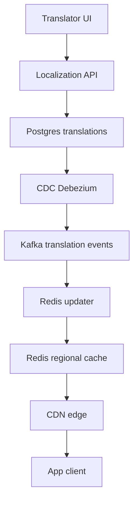
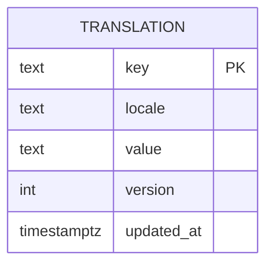

# 🌍 i18n System Design — Beginner README (Step by Step)

> Goal: show exactly how to design an internationalization system for static UI strings. This is a **starter path** you can read top to bottom and narrate in an interview.

---

## 📚 Table of Contents
1. What you are building
2. Functional requirements
3. Non‑functional requirements
4. Core concepts
5. Architecture overview
6. Data model
7. APIs
8. Read path and write path
9. Locale negotiation and fallbacks
10. ICU messages
11. Caching and propagation
12. Metrics and SLOs
13. 30‑second summary

---

## 1) What you are building
A read‑heavy platform that serves **system UI strings** in the user’s locale with low latency and sensible fallbacks.  
User content is **not** translated by this system.

---

## 2) Functional requirements
- Show UI strings in the user’s preferred locale.
- Use sensible fallbacks if a key is missing.
- Support dynamic messages with placeholders, pluralization, and gender.
- Serve localized assets when needed.
- Allow non‑engineers to update strings without app redeploys.

---

## 3) Non‑functional requirements
- Latency: **p95 < 50 ms** per lookup.
- Availability: **99.99%** globally.
- Propagation: updates visible in **< 60 seconds**.
- Consistency: avoid mixed language screens by using versioned bundles.

---

## 4) Core concepts
- **Key**: stable identifier like `home.title`.
- **Locale**: language and region like `fr_CA`.
- **Bundle**: a set of keys per surface like `home.json`.
- **Version**: an integer that changes when any key changes.

---

## 5) Architecture overview

**How to narrate:** translators edit strings in the UI. API writes to Postgres. CDC captures changes and sends events to Kafka. A Redis updater refreshes regional caches. CDN edges are purged. Apps read from the nearest edge first.

---

## 6) Data model

**Indexes**
- `(key, locale)`
- `(key, locale, version)`

---

## 7) APIs
- **GET /i18n/{locale}/{surface}** → `{ version, strings: { key: value } }`  
  Use for most reads. Cache on CDN. Include `ETag` with the version.

- **GET /i18n/{locale}/key/{key}** → `{ value, version }`  
  Use for rare single key fetch. Prefer bundles.

- **POST /i18n/translations** → `{ key, locale, value }`  
  Validates ICU, writes to DB, increments version, emits CDC.

---

## 8) Read path and write path

### Read path
1. App requests bundle from CDN.  
2. If edge hit → return immediately.  
3. If edge miss → Redis regional cache.  
4. If Redis miss → Postgres, then rehydrate Redis and return.

### Write path
1. Translator updates via API.  
2. Postgres write succeeds.  
3. CDC publishes event to Kafka.  
4. Redis updater refreshes keys.  
5. CDN edges for that bundle are purged.  
6. New reads hydrate caches with the new version.

---

## 9) Locale negotiation and fallbacks
- Chain: `lang_region` → `lang` → `default`.  
  Example: `fr_CA` → `fr` → `en`.
- Pick the first available translation. Log missing keys per locale.

---

## 10) ICU messages
- Use ICU MessageFormat for plural and gender rules.  
- Validate on upload: placeholder names, types, compile errors.  
- Escape user values at runtime.

---

## 11) Caching and propagation
- **CDN** caches bundles by locale and surface. Use short TTL and stale‑while‑revalidate.  
- **Redis** caches hot keys with `{ value, version }`.  
- **CDC** drives invalidation: Redis refresh and CDN purge.  
- **Versioned keys** ensure atomic rollouts per locale and surface.

---

## 12) Metrics and SLOs
- Read latency p50, p95, p99
- Redis hit rate, CDN hit rate
- CDC lag and propagation time
- Missing key rate per locale
- Rollback time

---

## 13) 30‑second summary
> “We decouple content from code. Apps read localized bundles from CDN with Redis and DB fallbacks. Updates flow via CDC to Kafka, refreshing Redis and purging edges in under a minute. Versioned bundles prevent mixed languages. ICU and fallbacks keep messages correct.”
