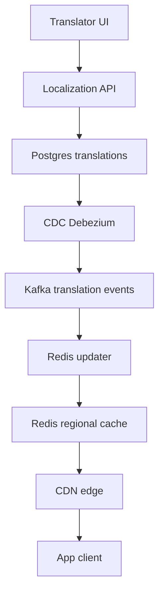
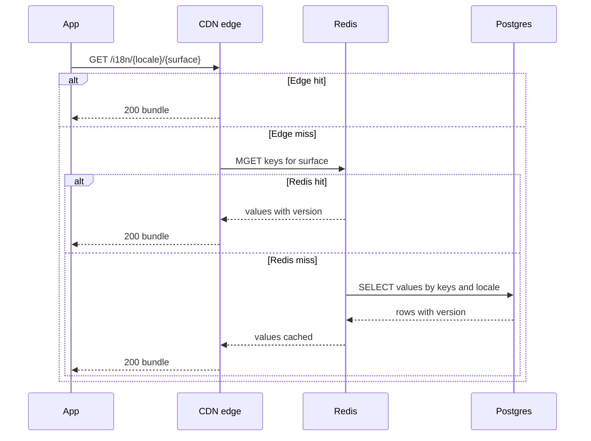
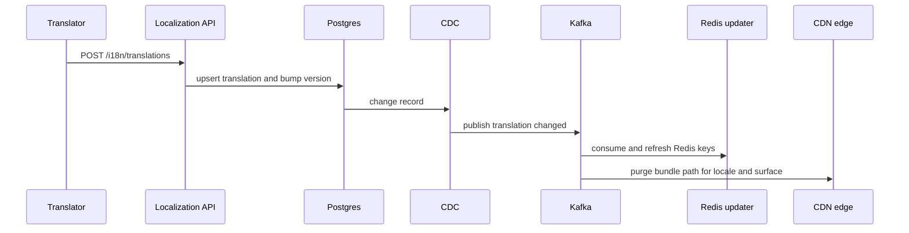

# 🌍 i18n System Design — Deep Dive README (Step by Step)

> A complete, interview‑grade design you can narrate end‑to‑end at Meta. Includes rationale, trade‑offs, scaling, and failure handling.

---

## 📚 Table of Contents
1. Problem statement and scope
2. Functional and non‑functional requirements
3. Core entities and API contracts
4. Architecture overview
5. Read path
6. Write path
7. Cache strategy and invalidation
8. Locale negotiation and versioning
9. ICU and safety
10. Scaling and propagation
11. Failure modes and recovery
12. Observability and KPIs
13. Trade‑offs
14. Interview summary

---

## 1) Problem statement and scope
Deliver **system UI strings** in hundreds of locales with low latency and high availability.  
User content is not translated. Non‑engineers can update strings without app redeploys.

---

## 2) Functional and non‑functional requirements
**Functional**
- Localized UI strings by locale.
- Fallbacks for partial coverage.
- Dynamic messages with placeholders, plural, gender.
- Localized assets when required.
- Near real time updates to strings.

**Non‑functional**
- p95 < 50 ms read latency.
- 99.99% global availability.
- Propagation < 60 seconds.
- No mixed‑version screens.
- Full audit trail and rollback.

---

## 3) Core entities and API contracts

### Entity: Translation
- `key` string
- `locale` string
- `value` string
- `version` integer
- `updated_at` timestamp

**Indexes**: `(key, locale)`, `(key, locale, version)`

### APIs
- `GET /i18n/{locale}/{surface}` → `{ version, strings }`  
  Notes: edge cached, `ETag` equals version.
- `GET /i18n/{locale}/key/{key}` → `{ value, version }`  
  Notes: rarely used.
- `POST /i18n/translations` → upsert; validates ICU, writes DB; increments version; emits CDC.

---

## 4) Architecture overview

**Why these parts**
- **Postgres**: ACID, versioned source of truth.
- **Kafka**: ordered change events for invalidation and analytics.
- **Redis**: sub‑ms lookups; regional sharing.
- **CDN**: global low latency reads.
- **ICU**: safe message formatting.

---

## 5) Read path

**Notes**: The edge caches bundles. Redis caches per key. DB is the fallback. All entries carry a `version` for atomic manifests.

---

## 6) Write path

**Effect**: New reads see the new version within seconds.

---

## 7) Cache strategy and invalidation
- **Keys**: `i18n:{locale}:{key}` → `{ value, version }`
- **Bundles**: `/i18n/{locale}/{surface}.json` with `ETag: "<version>"`
- **Invalidation**: CDC event triggers Redis refresh and CDN purge
- **TTL**: short TTL plus stale‑while‑revalidate at CDN
- **Coalescing**: batch identical misses and fetch by surface

---

## 8) Locale negotiation and versioning
- Fallback chain: `locale_with_region` → `base_language` → `default`  
  Example: `es_MX` → `es` → `en`
- Bundle manifest per locale and surface holds a single `version`
- Clients never mix versions on the same screen

---

## 9) ICU and safety
- Use ICU MessageFormat for plural and gender rules
- Validate on upload: placeholder names, types, compile step
- Escape user values on render
- Provide shared libraries to avoid per‑team reimplementation

---

## 10) Scaling and propagation
- **Latency**: in‑process LRU → Redis → CDN bundle; pre‑warm hot bundles per surface
- **Throughput**: shard Redis by locale; partition Kafka by `locale:key`
- **Propagation**: CDC to Kafka; Redis updater refreshes; CDN purge
- **Cold start**: background warmers after deploy; prioritized locales

---

## 11) Failure modes and recovery
- **Cache miss**: fall back to DB; rehydrate Redis
- **Stale CDN**: versioned paths and purge; serve stale then revalidate
- **Rollback**: keep N versions; switch manifest pointer back
- **Partial locale**: fallback chain applied; log missing keys

---

## 12) Observability and KPIs
- Read latency p50, p95, p99
- Redis hit rate and CDN hit rate
- CDC lag and time to consistency
- Missing key rate per locale
- Error rate on ICU validation
- Rollback success time

---

## 13) Trade‑offs

| Decision | Choice | Why | Trade‑off |
|---|---|---|---|
| Cache layers | CDN plus Redis | Global low latency | Invalidation complexity |
| Propagation | CDC to Kafka | Decoupled updates | Infra overhead |
| Source of truth | Postgres | ACID, audit, versioning | Write cost |
| Bundle vs key | Bundle per surface | Fewer round trips | Larger payload |
| Versioning | Atomic manifests | No mixed screens | Cache churn |

---

## 14) Interview summary
> “Apps read bundles from CDN with Redis and DB fallbacks. Translators update through an API; Postgres is truth; CDC emits Kafka events that refresh Redis and purge CDN. We version bundles atomically to avoid mixed languages, use ICU for safe dynamic messages, and hit p95 under 50 ms via layered caching and pre‑warming.”
