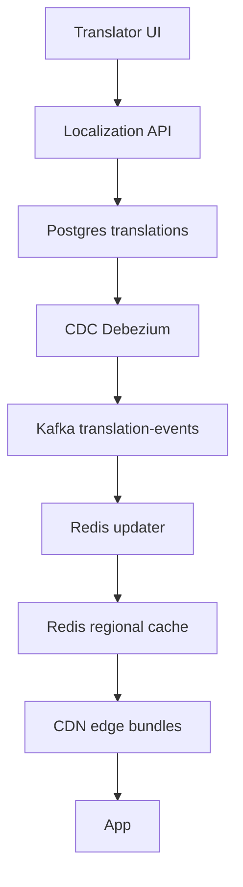
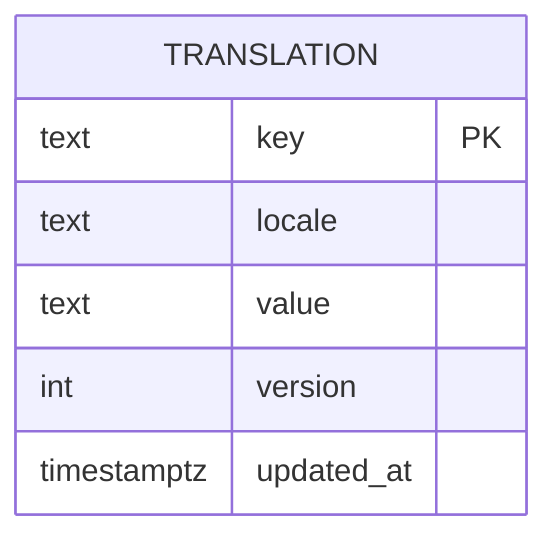

# 🌍 i18n System Design — Step‑by‑Step Tutorial

> Goal: learn exactly **what to do** to design an internationalization system from scratch, explain it in interviews, and scale it in production.

---

## 🔑 What you are building (in one sentence)
A **read‑heavy platform** that serves **system UI strings** in the user’s locale with **low latency**, **sensible fallbacks**, and **near‑real‑time updates** — *without redeploying apps*.

**Not in scope:** translating user content; machine translation.

---

## 🧭 Your roadmap (do these steps in order)

1) **State the problem** in your own words (30 sec)
   - “Serve system strings in 100+ locales. Keep user content as typed.”

2) **List requirements** (2 min)
   - **Functional:** localized UI, fallbacks, ICU placeholders, quick updates.
   - **Non‑functional:** p95 < 50 ms reads, 99.99% availability, fast propagation (<60 s), auditability.

3) **Draw the core architecture** (2–3 min) — use this exact diagram:



**Narration:** translators edit text → DB is truth → CDC to Kafka → Redis gets updated → CDN edges are invalidated → apps read from CDN first.

4) **Define the data model** (2 min)



5) **Design the APIs** (4 min)
- **Get bundle by locale and surface**  
  `GET /i18n/{locale}/{surface}` → `{ version, strings: { key: value } }`  
  Notes: cache on CDN, ETag: `W/"<version>"`

- **Get single key**  
  `GET /i18n/{locale}/key/{key}` → `{ value, version }`  
  Notes: use only for rare misses. Prefer bundles.

- **Upsert translation**  
  `POST /i18n/translations` → body: `{ key, locale, value }`  
  Server increments `version`, writes DB, CDC emits event.

6) **Specify cache keys** (1 min)
- Redis key: `i18n:{locale}:{key}` → `{ value, version }`
- CDN bundle path: `/i18n/{locale}/{surface}.json`
- Versioned pointer: `manifest:{locale}:{surface} -> v123`

7) **Explain read and write paths** (3 min)

**Read path (normal)**  
App → CDN (hit) → returns bundle fast.  
On miss → Redis → DB → rehydrate Redis → return and cache at CDN.

**Write path (update string)**  
Translator UI → API → Postgres → CDC → Kafka → Redis updater refreshes keys → CDN purge for that bundle.

8) **Locale negotiation and fallback** (1 min)
- Chain: `lang_region → lang → default` (e.g., `en_AU → en → en_US`).
- Choose the first that exists; log missing keys for dashboards.

9) **ICU_message handling** (1 min)
- Use ICU MessageFormat. Validate on upload (placeholders, types). Escape user values at runtime.

10) **Scaling plan** (3 min)
- **Latency:** in‑process LRU → Redis → CDN bundle; pre‑warm popular bundles.
- **Throughput:** shard Redis by locale; partition Kafka by `locale:key`; index DB on `(key, locale)`.
- **Propagation:** CDC events invalidate Redis and purge CDN; new reads hydrate caches.

11) **Failure and recovery** (2 min)
- **Cache miss:** fall back to DB, repopulate Redis, serve response.
- **Stale edge:** versioned keys; CDN uses stale‑while‑revalidate, then pulls new.
- **Rollback:** keep N bundle versions; switch manifest pointer back.
- **Hot spot:** coalesce identical concurrent misses; batch fetch by surface.

12) **Metrics & SLOs** (1 min)
- p50, p95, p99 read latency; Redis hit rate; CDN hit rate; CDC lag; missing‑key rate; rollback success rate.

13) **End your interview** (30 sec)
> “We decouple content from code, serve localized strings via CDN + Redis in <50 ms p95, and propagate updates via CDC in under a minute. Versioned bundles guarantee consistent UX, ICU and fallbacks ensure correctness, and the design scales linearly across locales and traffic.”

---

## 🧪 Copy‑paste snippets (use them in answers)

**Fallback function (pseudocode)**
```python
def get_value(key, locale):
    for l in [locale, base(locale), "en"]:
        v = redis.get(f"i18n:{l}:{key}")
        if v: return v
    # miss path
    row = db.query("select value, version from t where key=? and locale=?", key, locale)
    if row:
        redis.set(f"i18n:{locale}:{key}", row, ex=600)
        return row.value
    return "[missing]"
```

**CDC event schema**
```json
{
  "event": "translation_changed",
  "key": "home.title",
  "locale": "fr",
  "version": 124,
  "value": "Accueil",
  "ts": "2025-10-18T12:00:00Z"
}
```

**Bundle manifest**
```json
{
  "locale": "fr",
  "surface": "home",
  "version": 124,
  "strings": {
    "home.title": "Accueil",
    "search.cta": "Rechercher"
  }
}
```

---

## 🧠 Deep‑dive answers (memorize these)

- **How do you hit <50 ms p95?** layered caching (LRU → Redis → CDN), batching by surface, pre‑warm bundles, ETag version checks.  
- **How do you propagate changes?** CDC → Kafka → Redis invalidation + CDN purge; versioned keys avoid stale reads.  
- **How do you avoid mixed languages?** atomic bundle versions; switch manifest pointer (v123 → v124).  
- **How do you support pluralization/gender?** ICU MessageFormat; validate templates at upload; escape values at runtime.  
- **How do you choose locales?** deterministic chain `fr_CA → fr → en`; log missing keys to backfill.  

---

## 🧩 One‑page checklist (print this)

- [ ] Requirements stated (functional + NFRs)  
- [ ] Architecture drawn (DB + CDC + Kafka + Redis + CDN)  
- [ ] Data model and indexes defined  
- [ ] APIs defined (bundle, key, upsert)  
- [ ] Cache keys and version strategy picked  
- [ ] Read and write paths explained  
- [ ] Fallback and ICU covered  
- [ ] Scaling and propagation plan covered  
- [ ] Failure modes and rollback described  
- [ ] Metrics + SLOs named  
- [ ] 30‑sec closing summary ready

---

## 🏁 You can do this
If you can narrate this tutorial end‑to‑end, you can handle the Meta i18n system design interview. Start with the problem, draw the diagram, walk the read path, walk the write path, explain fallbacks and ICU, then finish with scaling and propagation.
