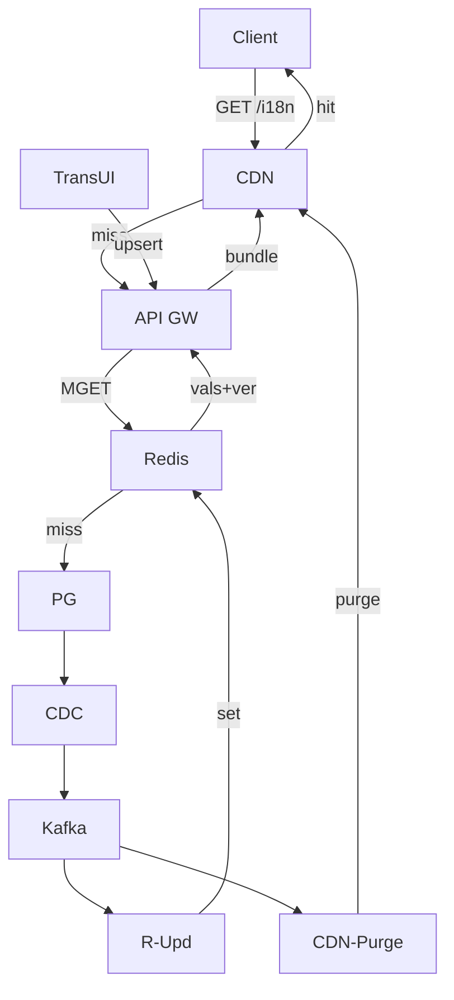

---
Legend
- Client (U): Web/iOS/Android app 
- CDN: Edge cache for bundles
- API GW (API): Localization API gateway
- Redis (R): Regional cache (i18n:{locale}:{key})
- PG (DB): Postgres source of truth (versioned)
- CDC: Change Data Capture (Debezium)
- Kafka (K): translation_events topic
- R-Upd (RU): Redis updater consumer
- CDN-Purge (CI): Edge invalidation worker
- TransUI (T): Translator/PM authoring tool

---

🧠 1. What the interviewer is asking

When they say:

“Design an i18n system.”

They mean:
Design the backend platform that delivers translated system UI strings (like buttons, menus, labels, notifications) to users all over the world — fast, consistently, and safely.

It’s not a language algorithm problem.
It’s a distributed systems and scalability problem.

---

💡 2. Why this problem exists

Facebook, Instagram, WhatsApp, etc. serve billions of users.
Every button and label (“Home,” “Share,” “Create Post”) must appear instantly in the right language — without deploying new code.

So your system needs to:

Serve localized UI content at <50ms p95 latency
> - Handle hundreds of languages
- Allow non-engineers (translators) to make updates
- Propagate changes globally in real time
- Avoid stale, mixed-language screens

---

🧩 3. What they want you to design (core components)
| Layer                          | Function                                                     | Tech Examples      |
| ------------------------------ | ------------------------------------------------------------ | ------------------ |
| **Client**                     | Fetches localized strings by locale (e.g., `en_US`, `fr_FR`) | HTTP API           |
| **CDN Edge**                   | Caches bundles per locale and surface                        | Akamai, Cloudflare |
| **Redis Cache**                | Regional cache for hot translations                          | Redis cluster      |
| **Database (Source of Truth)** | Stores all translations + versions                           | PostgreSQL         |
| **CDC / Kafka**                | Streams translation changes to invalidate caches             | Debezium + Kafka   |
| **Admin Tool**                 | Used by translators to edit text                             | Internal UI        |

---

⚙️ 4. What “design” means here

You must explain how to:
- Separate content from code — avoid hardcoding strings.
- Model data — key, locale, value, version.
- Design APIs — /i18n/{locale}/{surface} and /i18n/translations.
- Build caching layers — CDN → Redis → DB.
- Handle updates — CDC → Kafka → Redis → CDN.
- Support fallbacks — fr_CA → fr → en.
- Scale globally — replication, versioning, event propagation.

---

🧠 5. What interviewers are really testing
| Skill                     | What they’re evaluating                                                          |
| ------------------------- | -------------------------------------------------------------------------------- |
| **System decomposition**  | Can you identify and separate translation, caching, delivery, and update layers? |
| **Scalability & latency** | Do you use multi-tier caching (Redis + CDN)?                                     |
| **Consistency model**     | How do you keep translations fresh but not stale?                                |
| **Resilience**            | What happens if Redis or CDN fails?                                              |
| **Versioning strategy**   | How do you avoid half-new/half-old screens?                                      |
| **Real-world awareness**  | Do you consider non-engineer workflows (translators)?                            |

---

🧭 6. The standard design flow in an interview

> 1.	Clarify requirements.
Ask: “System UI only? Dynamic messages? Real-time updates?”
2.	Define functional & non-functional goals.
3.	Propose architecture.
Sketch Postgres → Redis → CDN → Client.
4.	Explain read path (hot path).
5.	Explain write/update path.
6.	Discuss propagation (CDC + events).
7.	Cover fallbacks, pluralization, ICU.
8.	Add metrics & versioning.
9.	Address trade-offs.

---

🧱 7. Example interview summary

“We separate content from code and store translations in a versioned DB.  
At runtime, clients fetch localized bundles from CDN with Redis and DB fallbacks.  
Updates propagate via CDC → Kafka to invalidate caches globally.  
We maintain p95 under 50ms with layered caching and atomic bundle versioning, ensuring consistent UI in any language.”  
