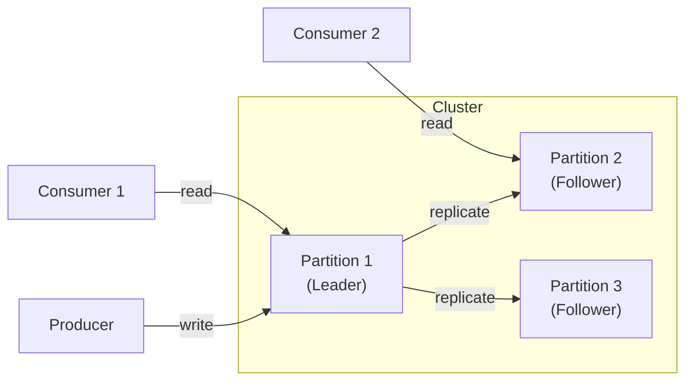
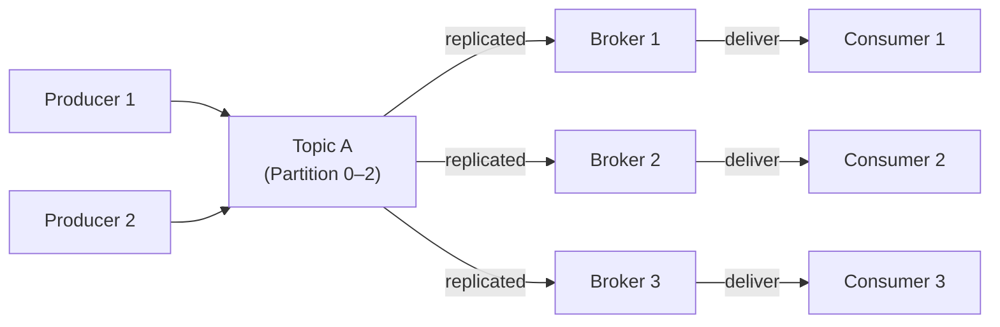
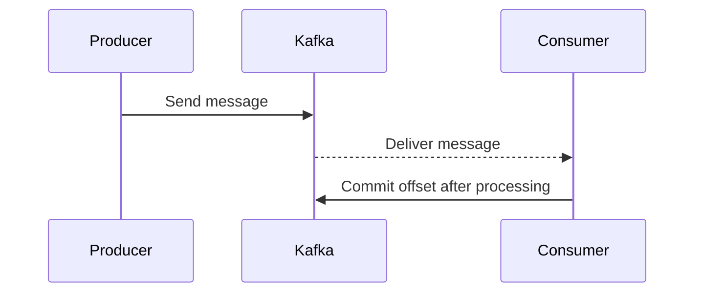
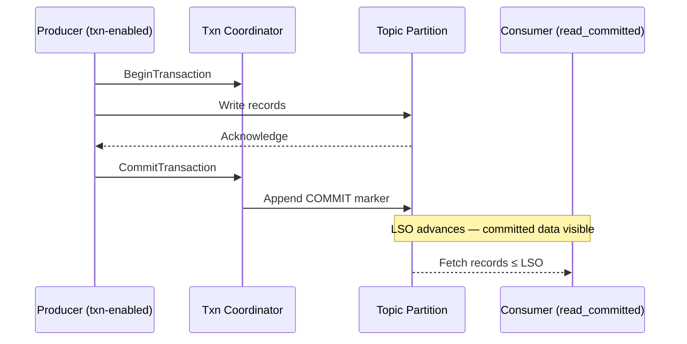
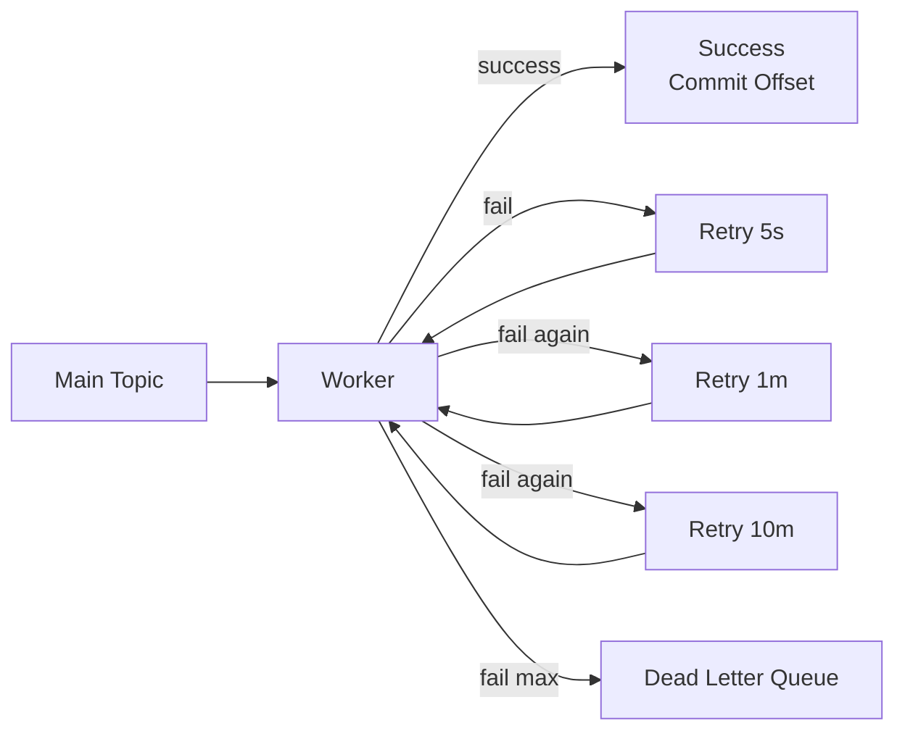

# ⚙️ Kafka Complete Guide

*A visual, beginner-friendly guide to how Kafka handles data flow, reliability, and recovery — designed for ADHD brains.*

---

## 📑 Table of Contents

1. [🧩 Core Concepts & Architecture](#c-ore-concepts--architecture)#-core-concepts--architecture
2. [🎛️ Control Knobs & Configuration](#-control-knobs--configuration)
3. [🔒 Messaging Guarantees](#-messaging-guarantees)
4. [💾 Transactions & Storage Layout](#-transactions--storage-layout)
5. [🚨 Failures, Retries & DLQ Handling](#-failures-retries--dlq-handling)
6. [🧠 Operational Tips & Monitoring](#-operational-tips--monitoring)
7. [📘 Quick Reference Cheat Sheet](#-quick-reference-cheat-sheet)

---

## 🧩 Core Concepts & Architecture

> 🎯 *Mental Model:* Kafka is like a durable postal system for data — producers write messages, brokers deliver them, and consumers pick them up when ready.

| Concept            | Quick Definition  | Why It Matters                  |
| ------------------ | ----------------- | ------------------------------- |
| **Topic**          | Named data stream | Producers write, consumers read |
| **Partition**      | Slice of a topic  | Enables scaling                 |
| **Broker**         | Kafka server      | Stores partitions               |
| **Consumer Group** | Set of consumers  | Ensures balanced consumption    |
| **Offset**         | Message position  | Enables replay/resume           |
| **Replication**    | Data copies       | Survives failure                |

> 💡 *Tip:* Kafka = “Google Drive for events.” Upload (produce) → Store → Download (consume).

[⬆️ Back to Top](#-kafka-complete-guide)

---

## 🎛️ Control Knobs & Configuration

> ⚙️ *Goal:* Tune Kafka between durability 🔒, performance ⚡, and availability 🌍.

| Knob                      | Safer Setting          | Pros                   | Cons                |
| ------------------------- | ---------------------- | ---------------------- | ------------------- |
| **Replication Factor ↑**  | 3+                     | Survives broker loss   | More disk & network |
| **min.insync.replicas ↑** | 2+                     | Guarantees consistency | May reject writes   |
| **acks=all**              | Waits for all replicas | Strong durability      | Higher latency      |

> 💡 *Tip:* Use `acks=all` + `min.insync.replicas=2` for production safety.
> ⚠️ *Watch out:* Don’t over-tighten these in dev — you’ll slow yourself down.

[⬆️ Back to Top](#-kafka-complete-guide)

---

## 🔒 Messaging Guarantees

> 🧠 *Question:* What’s safer — sending fast or never losing data? Kafka lets you choose.

| Guarantee         | Behavior               | Use When           |
| ----------------- | ---------------------- | ------------------ |
| **At-most-once**  | Message may be lost    | Telemetry, metrics |
| **At-least-once** | Message delivered ≥1   | Notifications      |
| **Exactly-once**  | Message once, no dupes | Payments, orders   |

> 💡 *Tip:* Start with *at-least-once* and dedupe by key.
> ⚠️ *Watch out:* Exactly-once needs `enable.idempotence=true` and transactions.

[⬆️ Back to Top](#-kafka-complete-guide)

---

## 💾 Transactions & Storage Layout

> 🧭 *Goal:* Understand how Kafka achieves atomicity — all or nothing.

| Term              | Definition                         | Analogy             |
| ----------------- | ---------------------------------- | ------------------- |
| **LSO**           | Last Stable Offset                 | End of visible data |
| **HW / LEO**      | High Watermark / Replication point | Durability fence    |
| **Commit Marker** | Control record for visibility      | Checkmark at end    |

> 💡 *Tip:* HW ≠ visible — visibility controlled by LSO.
> ⚠️ *Watch out:* Long-running transactions block consumers until commit.

[⬆️ Back to Top](#-kafka-complete-guide)

---

## 🚨 Failures, Retries & DLQ Handling

> 💥 *Goal:* Handle retries safely and isolate bad data.

> ⚠️ *Watch out:* Poison messages can block partitions — isolate with tiered retries.
> 💡 *Tip:* Add headers like `errorType`, `attempt`, `stacktrace` for DLQ analytics.

[⬆️ Back to Top](#-kafka-complete-guide)

---

## 🧠 Operational Tips & Monitoring

> 📊 *Goal:* Keep Kafka healthy and predictable.

| Area         | Metric                        | Why It Matters             |
| ------------ | ----------------------------- | -------------------------- |
| Producer     | `record-error-rate`           | Detect overload            |
| Consumer     | `lag`, `rebalance-count`      | Find bottlenecks           |
| Broker       | `under-replicated-partitions` | Detect instability         |
| Transactions | `txn-abort-rate`              | Reveal coordination issues |

> 💡 *Tip:* Monitor **Consumer Lag vs LSO** — if it widens, consumers are behind commits.
> ⚙️ *Pro Move:* Auto-heal stuck consumers by rebalancing groups on lag threshold.

[⬆️ Back to Top](#-kafka-complete-guide)

---

## 📘 Quick Reference Cheat Sheet

> 🧾 *Use this as your “first 10 seconds before panic” guide.*

| Goal           | Key Settings                        | Notes                               |
| -------------- | ----------------------------------- | ----------------------------------- |
| Safe writes    | `acks=all`, `min.insync.replicas=2` | Most reliable baseline              |
| Deduplication  | `enable.idempotence=true`           | Avoid duplicate sends               |
| Exactly-once   | + `transactional.id`                | Enables atomic offset + sink commit |
| Debugging lag  | Check consumer offsets              | Look for rebalances                 |
| Retry strategy | Tiered topics                       | Avoid partition blocking            |

> 💡 *Tip:* Kafka doesn’t lose data — you just have to tell it how patient to be.
> 🧩 *Mnemonic:* “Acks, Replicas, Transactions = ART of durability.”

[⬆️ Back to Top](#-kafka-complete-guide)
