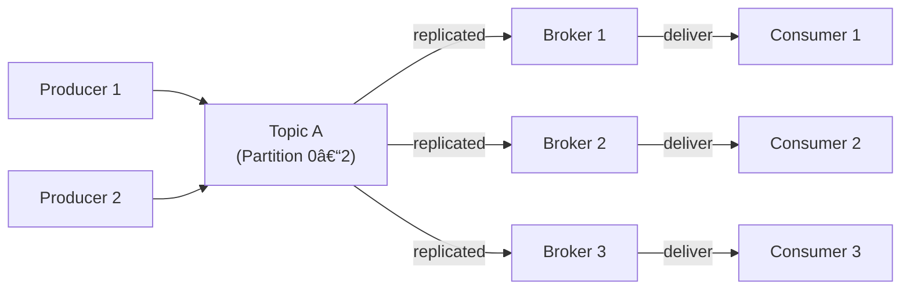
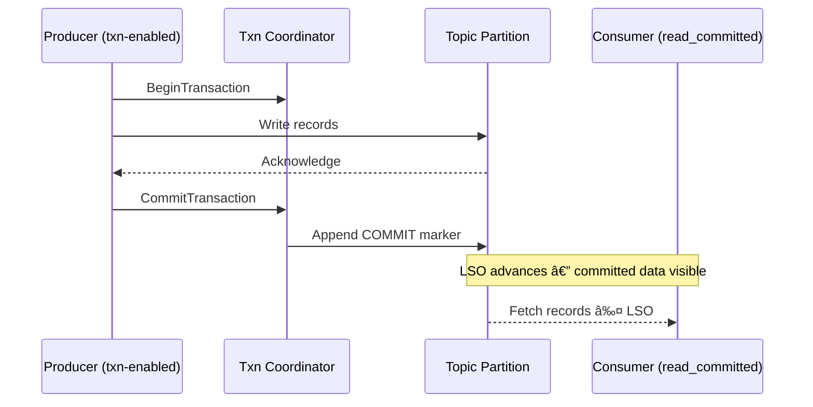
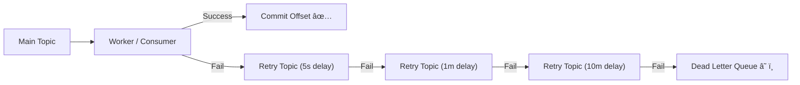

# Kafka Complete Guide

*A visual, beginner-friendly guide to how Kafka handles data flow, reliability, and recovery — designed for ADHD brains.*

--- 

## 📑 Table of Contents

1. [🧩 Core Concepts & Architecture](#-core-concepts--architecture)
2. [🎛️ Control Knobs & Configuration](#-control-knobs--configuration)
3. [📈 Scaling, Fan-In & Fan-Out](#-scaling-fan-in--fan-out)
4. [🔒 Messaging Guarantees](#-messaging-guarantees)
5. [💾 Transactions & Storage Layout](#-transactions--storage-layout)
6. [🚨 Failures, Retries & DLQ Handling](#-failures-retries--dlq-handling)
7. [🧠 Operational Tips & Monitoring](#-operational-tips--monitoring)
8. [📘 Quick Reference Cheat Sheet](#-quick-reference-cheat-sheet)

---

## 🧩 Core Concepts & Architecture

> 🎯 *Mental Model:* Kafka is like a durable postal system for data — producers write messages, brokers deliver them, and consumers pick them up when ready.

---

| Concept            | Quick Definition  | Why It Matters                  |
| ------------------ | ----------------- | ------------------------------- |
| **Topic**          | Named data stream | Producers write, consumers read |
| **Partition**      | Slice of a topic  | Enables scaling                 |
| **Broker**         | Kafka server      | Stores partitions               |
| **Consumer Group** | Set of consumers  | Ensures balanced consumption    |
| **Offset**         | Message position  | Enables replay/resume           |
| **Replication**    | Data copies       | Survives failure                |

> 💡 *Tip:* Kafka = “Google Drive for events.” Upload (produce) → Store → Download (consume).

  

[⬆️ Back to Top](#kafka-complete-guide)

---

## 🎛️ Control Knobs & Configuration

> ⚙️ *Goal:* Tune Kafka between durability 🔒, performance ⚡, and availability 🌍.

| Knob                      | Safer Setting          | Pros                   | Cons                |
| ------------------------- | ---------------------- | ---------------------- | ------------------- |
| **Replication Factor ↑**  | 3+                     | Survives broker loss   | More disk & network |
| **min.insync.replicas ↑** | 2+                     | Guarantees consistency | May reject writes   |
| **acks=all**              | Waits for all replicas | Strong durability      | Higher latency      |

> 💡 *Tip:* Use `acks=all` + `min.insync.replicas=2` for production safety.  
> ⚠️ *Watch out:* Don’t over-tighten these in dev — you’ll slow yourself down.

  

[⬆️ Back to Top](#kafka-complete-guide)

---

## 📈 Scaling, Fan-In & Fan-Out

> 🚀 *Goal:* Scale reads/writes safely, and understand how many-to-one (fan-in) and one-to-many (fan-out) flows work in Kafka.

---

### 🧩 Overview

Kafka’s architecture allows **horizontal scaling** of producers and consumers through **partitioned topics**. Scaling in Kafka is about distributing load across partitions and brokers while maintaining ordering guarantees and processing efficiency.

* **Fan-in**: Many producers send to one topic (many-to-one).
* **Fan-out**: One topic feeds multiple consumer groups (one-to-many).

---

### 🔄 Fan-Out (One Topic → Many Consumers)

When multiple consumer groups subscribe to the same topic, each group receives **every message**. Each group processes the data independently.

**Key points:**

* Add more **consumer groups** to branch processing logic (analytics, billing, ML, etc.).
* Add more **consumers per group** to parallelize processing (max = number of partitions).
* Scaling out consumers improves throughput, not delivery speed per partition.

> 💡 *Tip:* Each consumer group has its own offset tracking. Adding a new group won’t affect others.

---

### 🔁 Fan-In (Many Producers → One Topic)

Multiple producers can safely write to the same topic. Kafka uses **key-based partitioning** to ensure order for messages with the same key.

**Best practices:**

* Use **keys** (like `orderId`, `userId`) to preserve order per entity.
* Choose **high-cardinality keys** to avoid hot partitions.
* Avoid changing partition count after deployment unless you can tolerate rehashing.

> ⚠️ *Watch out:* Repartitioning changes key-to-partition mapping — this may break per-key ordering.

---

### ⚙️ Scaling Reads (Consumers)

| Area            | Guidance                                                                    |
| --------------- | --------------------------------------------------------------------------- |
| **Parallelism** | Max parallel consumers per group = number of partitions.                    |
| **Assignor**    | Use *cooperative-sticky* to minimize churn during rebalances.               |
| **Idempotence** | Make processing idempotent (or transactional) to allow retries safely.      |
| **Throughput**  | Add partitions for higher parallelism, but watch for coordination overhead. |

---

### ⚡ Scaling Writes (Producers)

| Tuning Area            | Setting                              | Impact                               |
| ---------------------- | ------------------------------------ | ------------------------------------ |
| **Partitioning**       | Increase partitions                  | Higher throughput (more parallelism) |
| **Batching**           | `batch.size`, `linger.ms`            | Reduces network overhead             |
| **Compression**        | `compression.type`                   | Reduces bandwidth, increases CPU     |
| **Sticky Partitioner** | Enabled by default (since Kafka 2.4) | Groups unkeyed messages efficiently  |

> 💡 *Tip:* Producer throughput scales best when partition counts and batch sizes are tuned together.

---

### 📚 Ordering Rules

* Kafka guarantees **order only within a partition**.
* No global ordering exists across partitions.
* To maintain ordering per entity, keep the same **key → partition** mapping.

> 🧩 *Analogy:* Each partition is its own conveyor belt — messages stay ordered on the belt, but belts move independently.

---

### 🔥 Avoiding Hot Partitions

| Problem              | Cause                    | Fix                                               |
| -------------------- | ------------------------ | ------------------------------------------------- |
| Uneven load          | Low key cardinality      | Use high-cardinality keys (`userId`, `sessionId`) |
| One key dominates    | Hot producer             | Shard key (e.g., `userId:hash(userId)%N`)         |
| Large partition skew | Inconsistent key hashing | Verify producer’s partitioner config              |

> ⚙️ *Pro Move:* Use a **custom partitioner** if workload skew is predictable (e.g., time-based bucketing).

---

### 🧠 Fan-Out to Downstream Systems

Each downstream system (database, index, ETL, ML feature pipeline) should have its **own consumer group**.

| Sink Type          | Connector                        | Example                                     |
| ------------------ | -------------------------------- | ------------------------------------------- |
| **Data Warehouse** | Kafka Connect JDBC Sink          | Write processed data to Snowflake, Postgres |
| **Search Index**   | Kafka Connect Elasticsearch Sink | Update search indexes in real-time          |
| **Object Storage** | S3 Sink / Debezium               | Archive historical data                     |

> 💡 *Tip:* Fan-out at the consumer layer keeps producers simple and topics clean.

---

### 🧾 Scaling Cheatsheet

| Scenario              | Recommendation                                   |
| --------------------- | ------------------------------------------------ |
| Throughput Bottleneck | Increase partitions, tune batch size & linger.ms |
| Consumer Lag          | Add consumers per group (up to partition count)  |
| Hot Key               | Shard key or rebalance producer load             |
| High Latency          | Compress batches, use async I/O                  |
| Cluster Saturation    | Add brokers and rebalance partitions             |

---

### 🧭 Visual Summary — Scaling Flow

> 🧠 *Rule of thumb:* **Add partitions** to scale **throughput**, **add consumer instances** to scale **processing**.

  

[⬆️ Back to Top](#kafka-complete-guide)

---

## 🔒 Messaging Guarantees

> 🧠 *Question:* What’s safer — sending fast or never losing data? Kafka lets you choose.

| Guarantee         | Behavior               | Use When           |
| ----------------- | ---------------------- | ------------------ |
| **At-most-once**  | Message may be lost    | Telemetry, metrics |
| **At-least-once** | Message delivered ≥1   | Notifications      |
| **Exactly-once**  | Message once, no dupes | Payments, orders   |

> 💡 *Tip:* Start with *at-least-once* and dedupe by key.
> ⚠️ *Watch out:* Exactly-once needs `enable.idempotence=true` and transactions.

  

[⬆️ Back to Top](#kafka-complete-guide)

---

## 💾 Transactions & Storage Layout

> 🧭 *Goal:* Understand how Kafka achieves atomicity — all or nothing.

| Term              | Definition                         | Analogy             |
| ----------------- | ---------------------------------- | ------------------- |
| **LSO**           | Last Stable Offset                 | End of visible data |
| **HW / LEO**      | High Watermark / Replication point | Durability fence    |
| **Commit Marker** | Control record for visibility      | Checkmark at end    |

> 💡 *Tip:* HW ≠ visible — visibility controlled by LSO.  
> ⚠️ *Watch out:* Long-running transactions block consumers until commit.

  

[⬆️ Back to Top](#kafka-complete-guide)

---

## 🚨 Failures, Retries & DLQ Handling

> 💥 *Goal:* Handle retries safely and isolate bad data.

 🧩 Core Idea

When a consumer or worker fails to process a message, Kafka does not delete or skip it—it simply keeps it at the same offset until acknowledged.
Retries and DLQs are custom layers you build on top of this guarantee.

---

| Tier           | Purpose                              | Typical Delay | Behavior                         |
| -------------- | ------------------------------------ | ------------- | -------------------------------- |
| **Main Topic** | First attempt                        | 0s            | Normal consumer processing       |
| **Retry-1**    | Short-term glitch (network, timeout) | 5s            | Immediate reattempt              |
| **Retry-2**    | Mid-term retry                       | 1m            | Allows transient issues to clear |
| **Retry-3**    | Long-term retry                      | 10m–1h        | Used for throttled backpressure  |
| **DLQ**        | Final sink for poison data           | N/A           | Human or automated review        |

---

🧱 Implementation Notes  
> •	Separate Topics: Each retry tier is its own Kafka topic. Messages are re-published with headers like retry_count, original_topic, and error_type.   
  •	Delay Mechanism: 
&nbsp;&nbsp;&nbsp;&nbsp;      - Use Kafka Streams, Kafka Connect, or Spring Retry for time-based requeueing. 
&nbsp;&nbsp;&nbsp;&nbsp;      - Some teams use scheduled consumer pause or delayed message pattern. 
  •	DLQ Schema: Include fields like 
&nbsp;&nbsp;&nbsp;&nbsp;      originalTopic, partition, offset, timestamp, exception, stacktrace. 
&nbsp;&nbsp;&nbsp;&nbsp;      This makes it queryable for root-cause analysis. 
  •	Consumer Behavior: Consumers should stop re-processing DLQ messages automatically — handle them separately via dashboards or alerts. 

---

⚖️ Best Practices
| Area                      | Tip                                    | Why                                    |
| ------------------------- | -------------------------------------- | -------------------------------------- |
| **Retry Limits**          | Cap retries (3–5 max)                  | Prevent infinite loops                 |
| **DLQ Monitoring**        | Track DLQ topic lag                    | Signals unhandled poison messages      |
| **Error Classification**  | Separate transient vs permanent errors | Enables smarter retry policies         |
| **Idempotent Processing** | Deduplicate by key or event ID         | Prevents double effects during retries |
| **Tracing**               | Include `correlationId`                | Makes debugging across retries easier  |

💡 Quick Mental Model
> Think of retries as ramps and the DLQ as a parking lot — messages keep climbing until they can’t, then park safely for inspection
---
> ⚠️ *Watch out:* Poison messages can block partitions — isolate with tiered retries.  
> 💡 *Tip:* Add headers like `errorType`, `attempt`, `stacktrace` for DLQ analytics.

 
 

[⬆️ Back to Top](#kafka-complete-guide)

---

## 🧠 Operational Tips & Monitoring

> 📊 *Goal:* Keep Kafka healthy and predictable.

| Area         | Metric                        | Why It Matters             |
| ------------ | ----------------------------- | -------------------------- |
| Producer     | `record-error-rate`           | Detect overload            |
| Consumer     | `lag`, `rebalance-count`      | Find bottlenecks           |
| Broker       | `under-replicated-partitions` | Detect instability         |
| Transactions | `txn-abort-rate`              | Reveal coordination issues |

> 💡 *Tip:* Monitor **Consumer Lag vs LSO** — if it widens, consumers are behind commits.  
> ⚙️ *Pro Move:* Auto-heal stuck consumers by rebalancing groups on lag threshold.

 
 

[⬆️ Back to Top](#kafka-complete-guide)

---

## 📘 Quick Reference Cheat Sheet

> 🧾 *Use this as your “first 10 seconds before panic” guide.*

| Goal           | Key Settings                        | Notes                               |
| -------------- | ----------------------------------- | ----------------------------------- |
| Safe writes    | `acks=all`, `min.insync.replicas=2` | Most reliable baseline              |
| Deduplication  | `enable.idempotence=true`           | Avoid duplicate sends               |
| Exactly-once   | + `transactional.id`                | Enables atomic offset + sink commit |
| Debugging lag  | Check consumer offsets              | Look for rebalances                 |
| Retry strategy | Tiered topics                       | Avoid partition blocking            |

> 💡 *Tip:* Kafka doesn’t lose data — you just have to tell it how patient to be.  
> 🧩 *Mnemonic:* “Acks, Replicas, Transactions = ART of durability.”

  

[⬆️ Back to Top](#kafka-complete-guide)
