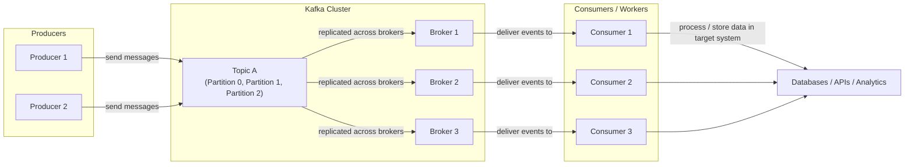

# ⚙️ Kafka Control Knobs (Tuning for Durability, Performance & Consistency)

> **Goal:** Learn which Kafka settings directly shape your system’s reliability and speed.  
> Think: “Three knobs — Safety, Speed, and Tolerance — you can twist to fit your workload.”

---

## 🎛️ Core Control Knobs

| Knob | What It Controls | Why It Matters |
|------|------------------|----------------|
| **Replication Factor** | How many copies of each partition exist across brokers | More replicas = more fault tolerance, but slower writes |
| **min.insync.replicas** | Minimum replicas that must confirm the write | Balances consistency vs availability during network issues |
| **acks** | How many acknowledgments the producer waits for | Adjusts between “fast but risky” and “slow but durable” writes |

---

## 🧠 Quick Visual Mental Model

### 💬 Read It Like a Story

1. 🧑‍💻 **Producers** send messages to **Kafka topics**.  
2. 📦 Kafka stores these in **partitions**, replicated across brokers.  
3. ⚙️ **Consumers (workers)** subscribe to the topics, reading messages in order.  
4. 💾 They process and write data into **target systems** (DBs, APIs, services).  
5. 🔁 Kafka ensures **durability**, **ordering within partitions**, and **at-least-once delivery** (depending on settings).  

---

###  ⚖️ Trade-Off Breakdown
| Knob                      | Safer Setting                 | Pros                    | Cons                             |
| ------------------------- | ----------------------------- | ----------------------- | -------------------------------- |
| **Replication Factor ↑**  | 3 or more                     | Survives broker failure | More disk + network cost         |
| **min.insync.replicas ↑** | 2 or more                     | Guarantees data safety  | Rejects writes when replicas lag |
| **acks = all**            | Wait for all in-sync replicas | Ensures durability      | Higher latency                   |

###  🧩 Real-World Scenarios
| Scenario                          | Suggested Settings                                  | Rationale                            |
| --------------------------------- | --------------------------------------------------- | ------------------------------------ |
| **Financial / Audit logs**        | Replication: 3, `min.insync.replicas=2`, `acks=all` | Prioritize safety over latency       |
| **Streaming metrics / telemetry** | Replication: 2, `acks=1`                            | Fast writes; data can be retried     |
| **Testing / local dev**           | Replication: 1, `acks=0`                            | Lightweight, no replication overhead |

###  🚀 ADHD Takeaways
•	Kafka “control knobs” let you tune between durability, performance, and availability.  
•	Replication Factor = number of safety copies.   
•	min.insync.replicas = quorum for consistency.  
•	acks = how many say “I got it!” before confirming.  
•	Tighten them for safety 🔒 — loosen them for speed ⚡.  

