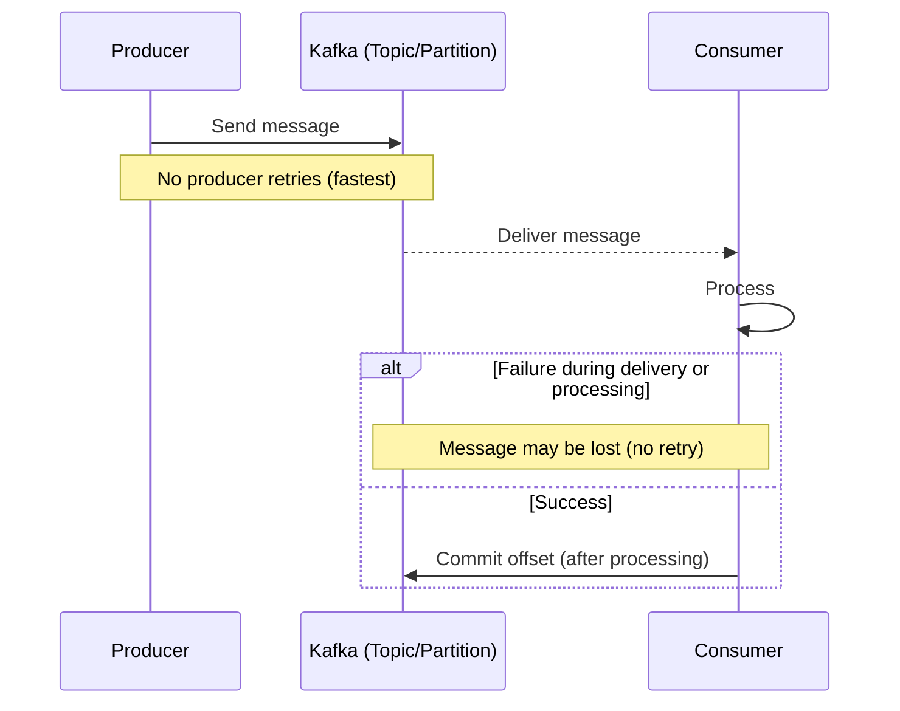
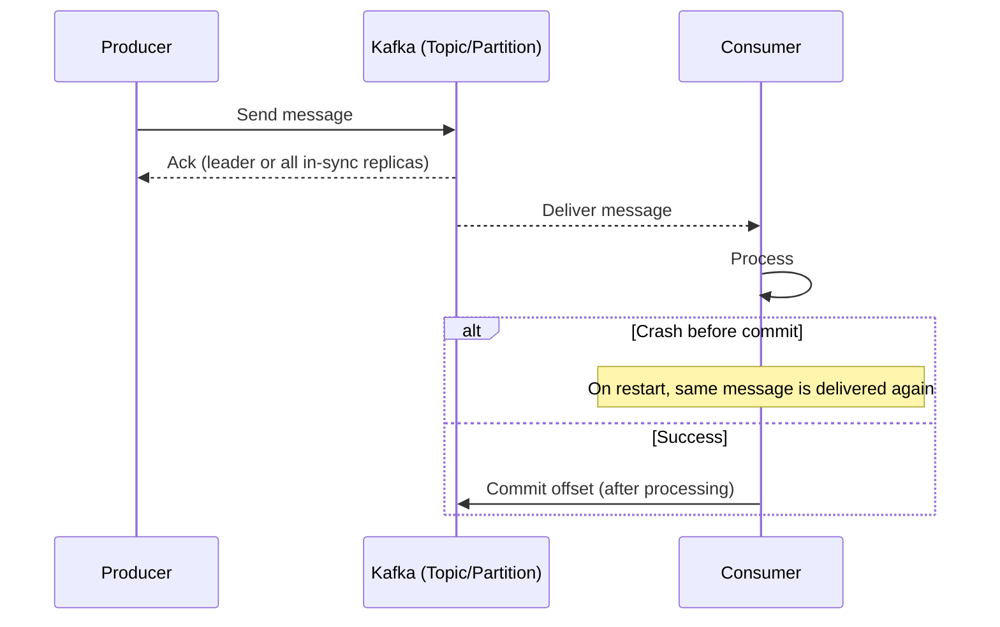
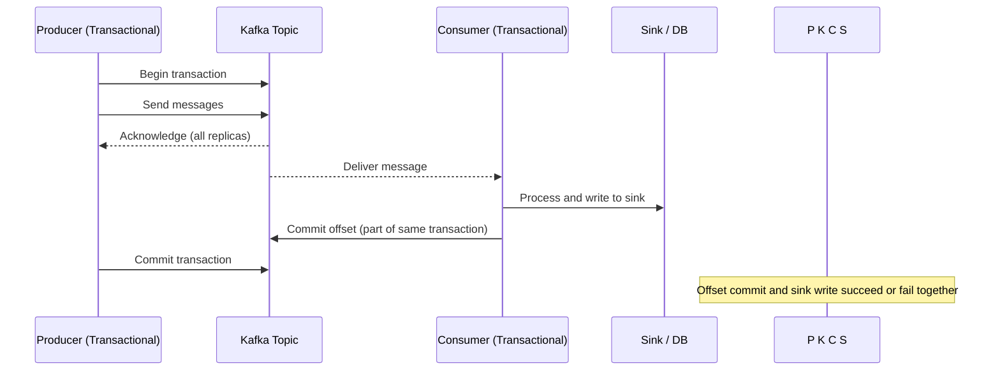

# 🔒 Kafka Messaging Guarantees

> **Goal:** Understand how Kafka ensures messages are delivered — and what trade-offs exist.  
> Think of this as: “Do I want to risk losing data, duplicating data, or slowing things down?”

---

## 🧩 1. Three Types of Delivery Semantics

| Guarantee | What Happens | Trade-off | Use Case |
|------------|---------------|------------|-----------|
| **At-most-once** | Messages may be lost, but never duplicated | Fastest ⚡, least safe | Metrics, logs, telemetry |
| **At-least-once** | Messages will be delivered, possibly more than once | Reliable but duplicates possible | Financial systems, notifications |
| **Exactly-once** | No loss, no duplicates — delivered once | Most complex, highest safety | Payment processing, transactions |

---

## 🧠 Concept Breakdown

- **At-most-once** → Fire and forget.  
  Producer sends and moves on. Fast but risky if failures occur.

- **At-least-once** → Retry on failure.  
  Data durability prioritized. Can lead to duplicate events if consumer doesn’t dedupe.

- **Exactly-once** → Transactional.  
  Requires idempotent producers and transactional commits.  
  Heavier, but ensures total accuracy.

---

# 🔒 Kafka Messaging Guarantees — Visualized

> How Kafka handles **loss**, **duplicates**, **retries**, and **offset commits**.

---

## 1) At-Most-Once (fastest, risk of loss)

**Idea:** Send → process → (maybe) commit. No retries; if anything fails, the message can be lost.  
**Typical config:** `acks=0` (or minimal), producer retries **off**.

Trade-off: ⚡ Fast + simple, but you can lose data on failures.

---

## 2) At-Least-Once (most common, possible duplicates)

Idea: Retries are allowed; consumer commits after processing. If a failure happens after processing but before commit, the message is re-delivered → duplicates possible.
Typical config: acks=1 or acks=all, producer retries on, consumer commits after processing.

Mitigation: Make consumers idempotent (dedupe by key, upserts, exactly-once sinks).

---

## 3) Exactly-Once (no loss, no duplicates)

Result: No loss, no duplicates. More setup + latency, but strongest guarantee.

---

Quick Settings Cheat-Sheet
| Goal              | Producer                                                      | Broker/Topic                        | Consumer                                          |
| ----------------- | ------------------------------------------------------------- | ----------------------------------- | ------------------------------------------------- |
| **At-most-once**  | `acks=0`, retries=off                                         | default                             | Commit whenever (risk of loss)                    |
| **At-least-once** | `acks=1` or `all`, retries=on                                 | `replication.factor>=2` recommended | **Commit after processing** (idempotent consumer) |
| **Exactly-once**  | `enable.idempotence=true`, `acks=all`, `transactional.id` set | `min.insync.replicas>=2`            | Transactional/atomic offset + sink commit         |

Idea: Use idempotent producers and transactions so the message processing and offset commit are atomic. Either both happen, or neither does.
Typical config: enable.idempotence=true, acks=all, transactional.id set; consumer uses transactional read/commit.

### ⚖️ Trade-Off Matrix
| Dimension           | At-most-once | At-least-once     | Exactly-once              |
| ------------------- | ------------ | ----------------- | ------------------------- |
| **Speed**           | 🔥 Fastest   | ⚖️ Moderate       | 🧊 Slowest                |
| **Complexity**      | Low          | Medium            | High                      |
| **Duplication**     | None         | Possible          | None                      |
| **Durability**      | Weak         | Strong            | Strongest                 |
| **Typical Setting** | `acks=0`     | `acks=1` or `all` | `acks=all` + transactions |

### 💡 Quick Mental Model
•	At-most-once -> prioritize speed (ok with loss).
•	At-least-once -> prioritize durability (ok with duplicates).
•	Exactly-once -> prioritize correctness (no loss, no dups) with transactions.

### 🧩 Real-World Example
| Scenario                | Recommended Guarantee | Rationale                           |
| ----------------------- | --------------------- | ----------------------------------- |
| Log aggregation         | **At-most-once**      | Some loss is okay for speed         |
| Notification service    | **At-least-once**     | Better to send twice than never     |
| Payment or order system | **Exactly-once**      | Duplicates or loss are unacceptable |

