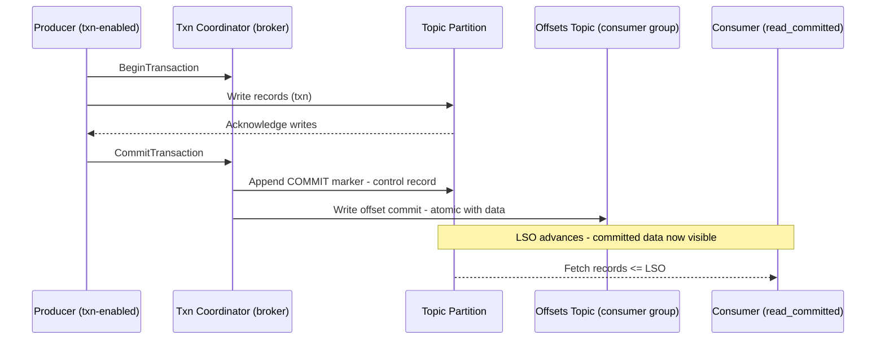
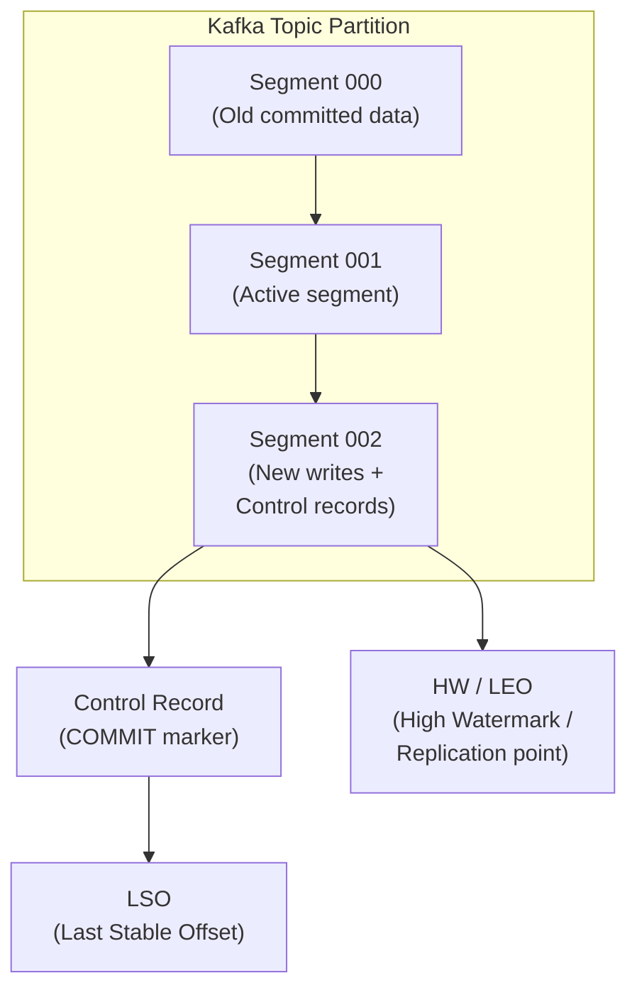

# ⚙️ Transactions, Storage Layout & Guarantees in Kafka

> How Kafka ensures **atomic writes**, **data visibility**, and **durability** under the hood.  
> Think: “Commit markers, log segments, isolation, and transactional state.”

---

## 🔁 Transactional Client & Atomicity

Kafka’s transactions let you group **writes + offset commits** into a single atomic operation.  
That means either *all* writes + offsets are applied, or *none* of them are visible.  

**How it works**
- A **transaction coordinator** (on a broker) manages global `BeginTransaction`, `CommitTransaction`, and `AbortTransaction` operations.  
- During commit, Kafka appends **COMMIT markers** to all affected partitions (data + offset topics).  
- Until that marker is visible, messages remain hidden from `read_committed` consumers.  
- Aborted or incomplete transactions are skipped.  
- Duplicate writes are prevented via **producer IDs (PIDs)** and **sequence numbers**.

---

## 🗄️ Storage Layout: Logs, Segments & Markers

Kafka stores data in **append-only logs**, divided into **segment files** (commonly ~1 GB each).  
New messages append to the active segment; once full, a new segment begins.  
Kafka flushes segments to disk based on size or time thresholds to guarantee durability.

**Transactions add control records to the same log:**
- `BEGIN`, `COMMIT`, and `ABORT` markers define transaction boundaries.  
- Consumers in `read_committed` mode only see messages up to the **Last Stable Offset (LSO)** — i.e., all messages before the most recent fully committed transaction.  
- Uncommitted messages beyond LSO are invisible until a commit or abort marker appears.

Transactional metadata is persisted in Kafka’s internal topic:  
`__transaction_state`, replicated and guarded by `min.insync.replicas`.

---

## 🔍 Isolation & Read Modes

Kafka consumers control visibility using the `isolation.level` setting:

| Isolation Level | Behavior | Use When |
|-----------------|-----------|-----------|
| `read_uncommitted` | Reads everything — even uncommitted or aborted messages | Low-latency or best-effort workloads |
| `read_committed` | Only sees committed data (≤ LSO) | For correctness and data consistency |

Commit markers and the **Last Stable Offset (LSO)** guarantee that `read_committed` consumers only see finalized transactions.

---

## 🧭 Transaction Flow — From Producer to Consumer

---

🧩 What This Shows

•	Producers begin a transaction, write data, and commit via the coordinator.  
•	The coordinator appends commit markers to both topic and offset partitions. 
•	Once commit markers are replicated, the LSO advances. 
•	read_committed consumers fetch only up to the LSO, skipping in-flight data. 

---

🗂️ Storage Layout — Segments, Control Records & LSO

---

Mental model
•	Kafka’s log is immutable and append-only. •	
•	Transaction markers live in-line with data.•	
•	The LSO marks the end of fully committed data.•	
•	The High Watermark (HW) ensures durability via replication, but doesn’t control visibility.•	

---

### 📦 Guarantees & Trade-Offs
| Guarantee                       | Mechanism                                            | Trade-Off                                       |
| ------------------------------- | ---------------------------------------------------- | ----------------------------------------------- |
| **Exactly-once (within Kafka)** | Transactions + idempotent producers + commit markers | Slightly higher latency + coordination overhead |
| **Durability**                  | Append-only logs + replication + flush policies      | Higher I/O and disk usage                       |
| **Ordering**                    | Per-partition sequencing                             | No cross-partition order                        |
| **Atomic visibility**           | Commit markers + LSO gating                          | Complexity in commit & abort logic              |

---

### 💡 Practical Notes & Tips
•	Transactions cover Kafka → Kafka operations (writes + offset commits).  
&nbsp;&nbsp;&nbsp;To include external systems (databases, APIs), use idempotent sinks or an Outbox pattern. 
•	The internal topic __transaction_state must meet min.insync.replicas to start transactions. 
•	Shorter transaction timeouts reduce risk of stalls but increase commit frequency. 
•	Key metrics to monitor:
   - txn-commit-time-ns-total 
   - EndTxn request rates 
   - Transaction abort rates 
   - Consumer lag vs LSO 

---

### 🧩 Recap

Kafka achieves atomicity, durability, and visibility control without distributed locks —
instead, it leverages append-only logs, control markers, and offset boundaries.

| Layer                    | Concept                        | Purpose                                      |
| ------------------------ | ------------------------------ | -------------------------------------------- |
| Transaction Coordinator  | Two-phase commit               | Atomicity across partitions                  |
| Control Records          | BEGIN / COMMIT / ABORT markers | Define transaction boundaries                |
| LSO (Last Stable Offset) | Visibility marker              | Controls what `read_committed` consumers see |
| Log Segments             | Sequential append files        | Durable, high-throughput storage             |
| `__transaction_state`    | Internal metadata topic        | Tracks transactional lifecycle               |
