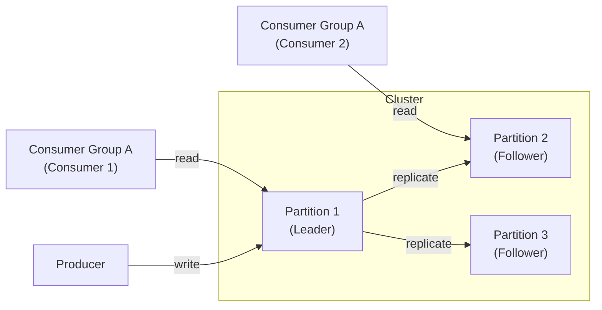

# 🧭 Introduction to Apache Kafka

> **Goal:** Understand Kafka as a distributed, durable, high-throughput messaging system.  
> Think: “A giant, replicated log that never forgets.”

---

## 🧠 Why Kafka Exists

Apps generate more data than traditional queues or databases can handle in real time.  
Kafka solves that by acting as a **central nervous system** for event streams — scalable, persistent, and replayable.

---

## 🧩 Core Concepts (in bite-sized chunks)

| Concept | Quick Definition | Why It Matters |
|----------|------------------|----------------|
| **Topic** | A named stream of data (like a channel) | Producers write to it; consumers read from it |
| **Partition** | A slice of a topic’s data | Enables horizontal scalability and parallelism |
| **Broker** | Kafka server that stores partitions | You run many brokers in a cluster |
| **Producer** | Sends messages to a topic | Defines message key → decides which partition |
| **Consumer** | Reads messages from partitions | Tracks offsets to know what’s been read |
| **Consumer Group** | A group of consumers sharing work | Ensures each message is processed once per group |
| **Offset** | Position of a message within a partition | Helps consumers resume from where they left off |
| **Replication** | Copies partitions across brokers | Keeps data safe and available during failures |

---

## ⚙️ Kafka Architecture (Visual)

---

###⚡ How It Works — Step by Step

1. Producer sends messages → Broker (Leader Partition)
2. Broker appends to the commit log (durable storage).
3. Followers replicate data for fault tolerance.
4. Consumers read sequentially using offsets.
5. Kafka tracks who read what via offsets per consumer group.
6. If a broker fails, a new leader is elected automatically.

### 🧱 Reliability & Scaling
| Concept                    | How It Helps                                                 |
| -------------------------- | ------------------------------------------------------------ |
| **Replication Factor**     | Number of copies across brokers                              |
| **ACKs**                   | Control durability (0 = fast, 1 = leader only, all = safest) |
| **ISR (In-Sync Replicas)** | Keeps track of healthy replicas ready to lead                |
| **Retention Policy**       | Controls how long Kafka keeps data (time or size)            |
| **Compaction**             | Keeps latest record per key, saves space                     |

🧩 Kafka = fast because writes are sequential, and reads are linear from disk (no random I/O).

### 🚧 Common Pitfalls
| Problem                 | Example                  | Mitigation                           |
| ----------------------- | ------------------------ | ------------------------------------ |
| **Consumer Lag**        | Consumers can’t keep up  | Scale consumers or tune fetch sizes  |
| **Replica Lag**         | Followers falling behind | Adjust replication factor / hardware |
| **Rebalancing Storms**  | Frequent group changes   | Use static group membership          |
| **Message Duplication** | At-least-once delivery   | Implement idempotent consumers       |

### 🧠 ADHD-Style Takeaways

•	🧱 Kafka = distributed commit log   
•	🚀 Scales by partitioning data across brokers  
•	🔁 Reliable via replication and leader election  
•	🧩 Replayable — can reprocess events anytime   
•	⚖️ Trade-offs: throughput vs consistency vs complexity   

### 💡 Quick Mental Model

Kafka is like a Google Drive for messages —  
producers upload files (events),   
consumers download them at their own pace,   
and Kafka never loses the originals.   

